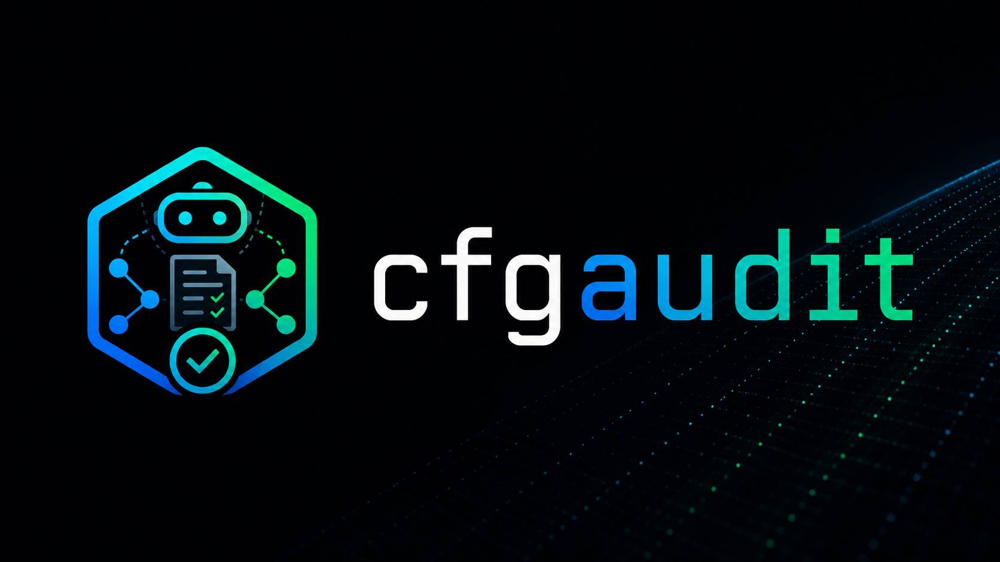

<p align="center">
  
</p>

# cfgaudit

Security auditor for AI-agent configuration files.

cfgaudit scans the configuration of AI coding assistants — starting with [Claude Code](https://docs.anthropic.com/en/docs/claude-code) — and flags settings that violate the principle of least privilege or leave sensitive files exposed to the agent's context.

Every finding maps to an [OWASP Top 10 for LLM Applications 2025](https://owasp.org/www-project-top-10-for-large-language-model-applications/) risk.

---

## Install

```sh
go install github.com/cfgaudit/cfgaudit/cmd/cfgaudit@latest
```

Pre-built binaries will be available on the [releases page](https://github.com/cfgaudit/cfgaudit/releases) once the first stable version is tagged.

---

## Usage

```sh
# Audit the current directory
cfgaudit

# Audit a specific project root
cfgaudit /path/to/project

# Output as JSON (for CI integration)
cfgaudit --format json

# Output as SARIF 2.1.0 (for GitHub Code Scanning)
cfgaudit --format sarif > cfgaudit.sarif

# Override the Claude Code version used for rule gating (otherwise detected via `claude --version`)
cfgaudit --claude-version 2.1.148

# Print cfgaudit version and exit
cfgaudit --version

# Run only specific rules (CSV or repeated; --only and --skip can be combined)
cfgaudit --only CFG001,CFG003
cfgaudit --only CFG001 --only CFG003
cfgaudit --skip CFG006,CFG009

# Use an explicit config file (otherwise .cfgaudit.yml is auto-discovered)
cfgaudit --config path/to/.cfgaudit.yml

# Also scan a Claude Code plugin/skill package
cfgaudit --plugins ./my-plugin

# Zero-tolerance CI: make warn findings fail the build too
cfgaudit --strict

# Explain a rule in the terminal (renders its docs)
cfgaudit explain CFG001

# List all rules (filter by OWASP, or output JSON)
cfgaudit list
cfgaudit list --owasp LLM06
cfgaudit list --format json
```

**Scope-aware findings**

Each finding carries a `Scope` (`project`, `project-local`, or `user`) reflecting which file it came from. Rules whose blast radius is amplified when the misconfiguration lives in user-global settings append an explanatory note to the message, and `CFG009` (hook command interpolates a shell variable) escalates from `warn` to `error` at user scope — a malicious hook in `~/.claude/settings.json` fires on every project the user opens.

**Version gating**

Some rules require a minimum Claude Code release before they make sense. cfgaudit runs `claude --version` once per invocation, compares the result to each rule's `MinVersion`, and replaces below-threshold rules with a single `info`-severity skip notice. The detected version is logged to stderr at the start of each scan; the `--claude-version` flag overrides detection (useful in CI containers where the binary is not installed). When neither detection nor the flag yields a version, every rule runs unconditionally.

**Exit codes**

| Code | Meaning |
|------|---------|
| `0` | No findings, or only `warn`/`info` (without `--strict`) |
| `1` | At least one `error`-severity finding (or any `warn` under `--strict` / `strict: true`) |
| `2` | Tool error (file not found, parse error) |

**Suppressing a finding**

Add a comment on the same line or the line above in the relevant config file:

```json
// cfgaudit:ignore CFG001 -- intentional for local dev sandbox
```

**Configuration file (`.cfgaudit.yml`)**

cfgaudit auto-discovers a `.cfgaudit.yml` (or `.cfgaudit.yaml`) in the scanned directory; `--config <path>` overrides discovery. CLI flags take precedence over the file.

```yaml
# Per-rule overrides
rules:
  CFG003: off           # disable a rule (flat form)
  CFG004:
    severity: warn      # override a rule's severity (also accepts the flat form CFG004: warn)

# Drop findings below this severity ("error", "warn", "info")
min-severity: warn

# Treat warn findings as errors for the exit code
strict: false

# Always exit 0 on a successful run (advisory mode for non-blocking CI)
no-exit-codes: false

# Path globs (relative to the scanned dir) whose findings are excluded.
# Supports *, ** and a trailing / for directory prefixes.
exclude-paths:
  - vendor/
  - "**/.claude/settings.local.json"

# Org policy (CFG025): commands that must be denied / must not be allowed.
# Matching is containment-aware (Bash(git:*) covers Bash(git commit:*)).
policy:
  require-deny:
    - "Bash(git commit:*)"   # must be covered by permissions.deny
  forbid-allow:
    - "Bash(git commit:*)"   # must not be grantable by permissions.allow
```

---

## What cfgaudit checks

Rules are grouped by the part of the configuration they target.

### `settings.json` — permissions, env, hooks & files

General Claude Code settings: the permission model, environment block, lifecycle hooks, command-running helpers, schema, and local-file hygiene.

| ID | Severity | Description | OWASP |
|----|----------|-------------|-------|
| [CFG001](docs/rules/CFG001.md) | error | `permissions.allow` contains unrestricted Bash pattern | LLM06 |
| [CFG002](docs/rules/CFG002.md) | warn | `permissions.allow` contains unrestricted `Edit(*)`/`Write(*)` | LLM06 |
| [CFG040](docs/rules/CFG040.md) | warn | `permissions.allow` contains unrestricted `WebFetch` (bare / `domain:*`) — fetch-any-URL exfiltration channel | LLM06 |
| [CFG023](docs/rules/CFG023.md) | error/warn | `permissions.allow` grants a dangerous command with wildcard args (`curl`/`sudo`/`npx`/shells → error; `find`/`sed`/`git`/interpreters/`ssh` → warn) | LLM06 |
| [CFG025](docs/rules/CFG025.md) | error | custom org policy from `.cfgaudit.yml` violated (`require-deny` / `forbid-allow`) — inert unless a `policy:` is configured | LLM06 |
| [CFG004](docs/rules/CFG004.md) | error/warn | `defaultMode` set to `bypassPermissions` or `auto` | LLM06 |
| [CFG005](docs/rules/CFG005.md) | error | `ANTHROPIC_BASE_URL` points to a non-Anthropic endpoint (CVE-2026-21852) | LLM02 |
| [CFG006](docs/rules/CFG006.md) | warn | `permissions.deny` is absent or empty — no guardrails block destructive operations | LLM06 |
| [CFG041](docs/rules/CFG041.md) | error | `permissions.deny` exists but does not restrict `.env` files — Claude can read credentials | LLM02 |
| [CFG042](docs/rules/CFG042.md) | error | `permissions.deny` does not restrict private-key / certificate files (`*.pem`/`*.key`/`*.p12`/`*.pfx`/`*.jks`) | LLM02 |
| [CFG007](docs/rules/CFG007.md) | error | `env` block contains a hardcoded secret (vendor key prefix or `*_TOKEN`/`*_SECRET`/...) | LLM02 |
| [CFG008](docs/rules/CFG008.md) | error | command matches a reverse-shell pattern (`/dev/tcp/`, `nc -e`, `bash -i …`, `mkfifo`, `socat exec`) — scans hooks and credential/runtime helpers | LLM06 |
| [CFG009](docs/rules/CFG009.md) | warn | command interpolates a shell variable (`$VAR` / `${VAR}`) — attacker-influenced data may reach a shell | LLM01 |
| [CFG012](docs/rules/CFG012.md) | warn | `settings.json` contains an unknown top-level key or a value whose type contradicts the bundled SchemaStore schema | LLM02 |
| [CFG013](docs/rules/CFG013.md) | warn | `.claude/settings.local.json` or `CLAUDE.local.md` exists in the repo but is not excluded by `.gitignore` | LLM02 |
| [CFG014](docs/rules/CFG014.md) | error | command pipes `curl`/`wget` output directly into a shell or interpreter (remote code execution) | LLM03 |
| [CFG015](docs/rules/CFG015.md) | warn/error | command contains `$(…)` or backtick substitution (error if the substitution itself reaches the network) | LLM01 |
| [CFG016](docs/rules/CFG016.md) | error/info | credential helper (`apiKeyHelper`, `awsCredentialExport`, `awsAuthRefresh`, `gcpAuthRefresh`) defined in project-scoped settings (CVE-2025-59536) | LLM02 |
| [CFG022](docs/rules/CFG022.md) | error/warn | `sandbox` config weakens or hijacks the execution sandbox (`excludedCommands` wildcard/shell, `bwrapPath`/`socatPath`) (CVE-2026-39861) | LLM06 |
| [CFG027](docs/rules/CFG027.md) | error | command installs a persistence mechanism (cron, shell startup files, `systemctl enable`, launchd) — scans hooks and helpers | LLM06 |
| [CFG028](docs/rules/CFG028.md) | error | command writes to a Claude trust/config file (`CLAUDE.md`, `settings.json`, `.mcp.json`, `.claude/`) — self-perpetuating injection / persistence | LLM06 |
| [CFG037](docs/rules/CFG037.md) | error | command reads or copies SSH private keys (`~/.ssh/id_rsa`, `id_ed25519`, …) — scans hooks and helpers | LLM02 |
| [CFG038](docs/rules/CFG038.md) | error | command dumps environment variables to the network (`env`/`printenv` → `curl`/`nc`) — exfiltrates all secrets | LLM02 |
| [CFG039](docs/rules/CFG039.md) | warn/error | command runs a recursive force-delete (`rm -rf`) — error when the target is broad (`~`, `/`, `..`, `$HOME`, `*`) | LLM06 |

### MCP servers — `settings.json` `mcpServers` & `.mcp.json`

Rules about MCP servers. The per-server checks run against MCP servers from **both** sources — the inline `mcpServers` block in `settings.json` and the project's root `.mcp.json` (the file that `enableAllProjectMcpServers` / `enabledMcpjsonServers` auto-approve) — and attribute each finding to the file the server was declared in. A malformed `.mcp.json` is reported as a tool error rather than silently skipped. `CFG003` governs the blanket auto-approval flag and applies to `settings.json` only.

| ID | Severity | Description | OWASP |
|----|----------|-------------|-------|
| [CFG003](docs/rules/CFG003.md) | error | `enableAllProjectMcpServers: true` — auto-approves all repo MCP servers (CVE-2025-59536) | LLM06 |
| [CFG010](docs/rules/CFG010.md) | warn | MCP server uses unpinned package or image version (`@latest`, `:latest`, no `@version`) | LLM03 |
| [CFG011](docs/rules/CFG011.md) | warn | MCP server `alwaysAllow` is too broad (wildcard, state-mutating tools, or 10+ entries) | LLM06 |
| [CFG017](docs/rules/CFG017.md) | error | MCP server sets `dangerouslyAllowBrowser: true` — browser-originated requests enable DNS-rebinding to RCE (CVE-2025-49596) | LLM06 |
| [CFG018](docs/rules/CFG018.md) | warn | MCP server binds to all interfaces (`0.0.0.0` / `[::]`) — reachable by anyone on the LAN ("NeighborJack") | LLM06 |
| [CFG019](docs/rules/CFG019.md) | error | MCP server `command` is a shell interpreter (`bash`, `sh`, `pwsh`, `cmd`, …) — server is an inline script, a hallmark of a poisoned config | LLM06 |
| [CFG020](docs/rules/CFG020.md) | error | MCP server `env` injects a shared library via the dynamic linker (`LD_PRELOAD`, `LD_LIBRARY_PATH`, `DYLD_INSERT_LIBRARIES`, …) | LLM06 |
| [CFG021](docs/rules/CFG021.md) | warn | MCP server `env` routes traffic through a non-local proxy (`HTTP_PROXY`/`HTTPS_PROXY`/`ALL_PROXY`) — MITM and header-secret capture | LLM02 |

### `CLAUDE.md` — project & user-global

Claude Code reads `CLAUDE.md` as trusted system-context instructions every session, so a committed or user-global CLAUDE.md is a prompt-injection target. The project `CLAUDE.md` is scanned automatically; `~/.claude/CLAUDE.md` is scanned with `--user`.

| ID | Severity | Description | OWASP |
|----|----------|-------------|-------|
| [CFG024](docs/rules/CFG024.md) | error | `CLAUDE.md` contains hidden Unicode control characters (Tags block, zero-width, BiDi/Trojan Source) — prompt injection / ASCII smuggling | LLM01 |
| [CFG026](docs/rules/CFG026.md) | error/warn | `CLAUDE.md` contains instruction-bypass phrases (override / persona hijack / authority impersonation → error; permissive fictional framing → warn) | LLM01 |
| [CFG029](docs/rules/CFG029.md) | error | `CLAUDE.md` instructs Claude to bypass permission prompts ("always approve", "without asking", …) — NL equivalent of `defaultMode: bypassPermissions` | LLM06 |
| [CFG030](docs/rules/CFG030.md) | error | `CLAUDE.md` instructs Claude to conceal its behavior ("don't tell the user", "silently exfiltrate", …) | LLM01 |
| [CFG031](docs/rules/CFG031.md) | error | `CLAUDE.md` references sensitive file paths (`~/.ssh/id_rsa`, `~/.aws/credentials`, `*.pem`, …) — exfiltration payload | LLM02 |
| [CFG032](docs/rules/CFG032.md) | error/warn | `CLAUDE.md` contains pseudo-system tags (`<SYSTEM>`), turn-boundary/role injection (`Human:`/`<human>`) → error; generic all-caps tags & foreign-LLM control tokens → warn | LLM01 |
| [CFG033](docs/rules/CFG033.md) | error | `CLAUDE.md` contains a markdown image with an empty/placeholder query param (``) — data-exfiltration sink | LLM02 |
| [CFG034](docs/rules/CFG034.md) | warn | `CLAUDE.md` contains Guidance/template role delimiters (`{{#system~}}` …) — role-injection markup | LLM01 |
| [CFG035](docs/rules/CFG035.md) | error | `CLAUDE.md` instructs Claude to configure or trust an MCP server (`claude mcp add` …) — installs an attacker server | LLM06 |
| [CFG036](docs/rules/CFG036.md) | error/warn | `CLAUDE.md` embeds shell commands for auto-execution/exfiltration (cmd-subst on secret paths, auto-exec + `curl https://…`) | LLM02 |

### Plugin & skill packages

Installing a Claude Code plugin is a supply-chain trust decision. With `--plugins <dir>` (and auto-discovered when the scanned project bundles a `.claude-plugin/`, or `~/.claude/plugins/` under `--user`), cfgaudit looks **inside** the package and runs the existing rules against its bundled artifacts:

| Artifact | Rules applied |
|----------|---------------|
| `SKILL.md` | CLAUDE.md content rules — CFG024 (hidden Unicode), CFG026 (instruction-bypass) |
| `hooks/hooks.json` | command-content rules — CFG008, CFG009, CFG014, CFG015, CFG027, CFG028 |
| `plugin.json` `mcpServers` | MCP rules — CFG010, CFG011, CFG017–CFG021 |

Findings are attributed to the in-package file. Bundled binaries / arbitrary scripts are **not** content-scanned (that is general SAST, outside cfgaudit's config-audit scope).

---

## OWASP mapping

cfgaudit is a **static auditor of Claude Code configuration files**. It maps each finding to an [OWASP Top 10 for LLM Applications 2025](https://owasp.org/www-project-top-10-for-large-language-model-applications/) risk — but by design it only sees what is *declared in config*, not model behaviour, runtime traffic, or training data. That scope determines which risks it can and cannot address.

**Covered**

| ID | Risk | Example rules |
|----|------|---------------|
| LLM01 | [Prompt Injection](https://owasp.org/www-project-top-10-for-large-language-model-applications/2025/LLM01_2025-Prompt_Injection.html) | CFG009, CFG015, CFG024, CFG026, CFG030, CFG032, CFG034 |
| LLM02 | [Sensitive Information Disclosure](https://owasp.org/www-project-top-10-for-large-language-model-applications/2025/LLM02_2025-Sensitive_Information_Disclosure.html) | CFG005, CFG007, CFG012, CFG013, CFG016, CFG021, CFG031, CFG033, CFG036, CFG037, CFG038, CFG041, CFG042 |
| LLM03 | [Supply Chain Vulnerabilities](https://owasp.org/www-project-top-10-for-large-language-model-applications/2025/LLM03_2025-Supply_Chain.html) | CFG010, CFG014 |
| LLM06 | [Excessive Agency](https://owasp.org/www-project-top-10-for-large-language-model-applications/2025/LLM06_2025-Excessive_Agency.html) | CFG001–CFG004, CFG006, CFG008, CFG011, CFG017–CFG020, CFG022, CFG023, CFG025, CFG027, CFG028, CFG029, CFG035, CFG039, CFG040 |

**Not covered**

| ID | Risk | Why it is out of scope |
|----|------|------------------------|
| LLM04 | [Data and Model Poisoning](https://owasp.org/www-project-top-10-for-large-language-model-applications/2025/LLM04_2025-Data_and_Model_Poisoning.html) | Concerns training data and model weights. cfgaudit audits config files, not models or training pipelines. |
| LLM05 | [Improper Output Handling](https://owasp.org/www-project-top-10-for-large-language-model-applications/2025/LLM05_2025-Improper_Output_Handling.html) | A runtime property of how downstream systems consume model output — not visible in static configuration. |
| LLM07 | [System Prompt Leakage](https://owasp.org/www-project-top-10-for-large-language-model-applications/2025/LLM07_2025-System_Prompt_Leakage.html) | Lives in prompt *content* (e.g. `CLAUDE.md`), not in settings. On the roadmap once CLAUDE.md scanning lands (see the open `rule` issues). |
| LLM08 | [Vector and Embedding Weaknesses](https://owasp.org/www-project-top-10-for-large-language-model-applications/2025/LLM08_2025-Vector_and_Embedding_Weaknesses.html) | Specific to RAG / embedding stores, which Claude Code configuration does not describe. |
| LLM09 | [Misinformation](https://owasp.org/www-project-top-10-for-large-language-model-applications/2025/LLM09_2025-Misinformation.html) | A model-output-quality concern, not a configuration setting. |
| LLM10 | [Unbounded Consumption](https://owasp.org/www-project-top-10-for-large-language-model-applications/2025/LLM10_2025-Unbounded_Consumption.html) | Runtime resource / cost / DoS behaviour, not expressed in the config cfgaudit reads. |

---

## Test fixtures

Real-world `settings.json` examples live under `testdata/settings/`:

- `valid/` — configurations that must produce **zero** cfgaudit findings (minimal, fully-populated, team, managed-org).
- `invalid/` — one fixture per rule, named `CFG###_<slug>.json`. Each must trigger the rule encoded in its prefix.

`rules/fixtures_test.go` enforces both invariants on every Go test run, so fixtures and rule implementations stay in lockstep.

A separate workflow (`.github/workflows/schema-validation.yml`) validates every file in `valid/` against the [SchemaStore Claude Code settings schema](https://json.schemastore.org/claude-code-settings.json) on push, on pull request, and nightly. If the upstream schema changes, the nightly run opens (or comments on) a tracking issue so the fixtures and rules can be brought back in sync before silent breakage.

---

## Contributing

See [CONTRIBUTING.md](CONTRIBUTING.md) for dev setup, the test loop, and the step-by-step recipe for adding a new rule.

---

## License

Apache 2.0 — see [LICENSE](LICENSE).
